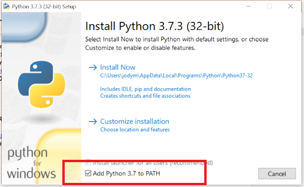
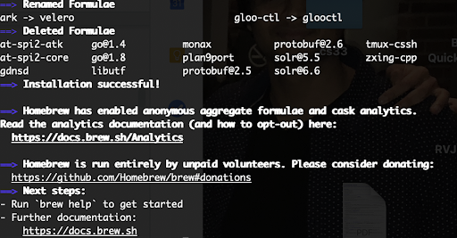
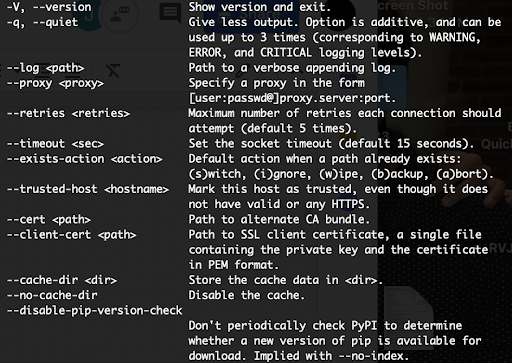

# Learn.py Session 1 Basics of Python: Data Types, I/O, Control Flow

**Location:** Covel 227

**Time:** 6:15pm - 8:15pm, 10 April 2019

**Teacher:** Jody Lin

## Resources
**Slides**
* [Slides](https://docs.google.com/presentation/d/1AW-HPMYfJziM7V_ovLN9W09NjdhKcA4qTVpGk1qOLvg/edit?usp=sharing)

**ACM Membership Attendance Portal**

* [Portal](https://members.uclaacm.com/login)

## What we'll be learning today
* What is Python?
* How to Install and Run Python
* Variables and Basic Types
* Basic Arithmetic
* Basic I/O
* Conditionals
* Loops
* Intro to Functions


## What is Python?
An easy to learn programming language created in 1991 by Guido van Rossum:

(this dude)

So why learn Python?
* Easy to learn syntax.
* For geeks: Interpreting language rather than a compiling language.

Fun Fact: Python is named after Monty Python, not the snake :)

We will be teaching Python 3 rather than Python 2. Python 2 will no longer be maintained after 2020.


## How to Install and Run Python
How to download Python for:

**Windows**
1. Download the Python 3 installer (https://www.python.org/downloads/windows/)
2. Click "Latest Python 3 Release - Python 3.x.x" (As of now, it’s 3.7.3)
3. Scroll to the bottom and select either Windows x86-64 executable installer for 64-bit or Windows x86 executable installer for 32-bit.
4. Run the installer
5. Make sure to check "Add Python 3.x to PATH"



**Mac**

_Install homebrew_
Go to http://brew.sh/
1. Copy the code under "Install Homebrew"
    * /usr/bin/ruby -e "$(curl -fsSL https://raw.githubusercontent.com/Homebrew/install/master/install)"
2. Run that code in a terminal window (this will take a while)
    * Note: Apple<sup>TM</sup> might ask you to install their CoMmAnD LiNe DeVeLoPeR ToOlS: Just confirm and install those.
3. Confirm the "The software was installed" dialog from the developer tools installer
4. In the terminal, hit ENTER to continue with the installation
    * Homebrew will ask for your device password to finish the installation. It will download the files it needs. Hopefully UCLA’s internet connection isn’t terrible.

It should say "Installation successful"

_Install Python_
1. Type "brew install python3" and hit ENTER all in the terminal
2. You should be done
3. Check the install by typing pip3 and ENTER in the terminal
    * It should give you usage information similar to the following, and not -bash: pip3: command not found"


If not, retry the installation or call a mentor.


_Command line_
* cd: change (working) directory – moves you into a different folder
* cd ..   move back into the parent directory
* rm <file>: remove a file
* rm -f <file>: remove a folder and all its contents
* rmdir: remove an empty directory (folder)

_Running a Python Script_
_Windows_
1. Change directories into the folder that contains your python script (.py)
    * cd /folder/that/holds/the/python/script.py
2. Type: python.exe file_name.py
This begins executing your python file in the terminal
_Mac_
1. Change directories into the folder that contains your python script (.py)
2. Type: python3 <file> (or python3.7 <file>)
    * This runs python in the terminal
You can type a .py file after this to run that file


## Variables and Basic Types
What is a variable? A variable is anything that holds a value.

Just like in math or science class, we can say that the variable x represents the height of a building, the displacement of an object, or number of L's you took last quarter, in Python we can declare a variable to hold almost anything.

For example:
```python
myPhysicsGrade = 65
```

So what does this do? Well, the number 65 has just been stored in memory on our computer under the name `myPhysicsGrade`. Later on, we can have access to our stored value of 65 by simply using the name we gave it.

So typing out `print(myPhysicsGrade)` will output 65, which is the value we have stored in the `myPhysicsGrade` variable.

What other kinds of things can we store in a variable? Could we have instead typed this?
```python
myPhysicsGrade = 'C'
```
The answer is yes! In this case, we have stored what we called a **string** inside our variable `myPhysicsGrade`.

So what are some of the basic types we can store in variables? Some of these basic types include **booleans**, **integers**, **floats**, and **strings**. So what are these?

### Booleans
This type of variable simply stores the value 'True' or 'False'.

Example: `doILoveBoba = True` or `schoolIsFun = False`

### Integers
This is (suprise!) just anything that is an integer (does not contain a decimal). So the variable we used before called `myPhysicsGrade` stored the integer value 65.

Integers can be declared with an integer literal (a whole number) or with the int constructor.   

Here's an example of this:
```python
UCLATuition = 12763
USCTuition = 500000
howCoolIsUCLA = int(100000)
howCoolIsUSC = int(-10000)
```

For the geeks out there who get bored counting in base 10, you can also specify the base of an integer in python!
```python
fiveInBaseTwo = ('0101', 2)
```
This will store the binary value 0101 (5 in base 10).

_Note: To declare an integer this way, the integer must be in the form of a string and the base must be of type int._

Also note that there is no size limitation on an integer! As long as there is memory left on the computer, you can make an integer as large or small as you want!

### Floats
Float stands for "Floating-Point", which is just a fancy way of saying "a number with a decimal". This can be 3.14, -8.3749, or even just, 0.0.

Here are some ways to declare floats:
```python
pi = 3.1415926535989793238462643383
float('+1.23')
  # 1.23
float('1e-003')
  # 0.001
float('+1E6')
  # 1000000.0
float('-Infinity')
  # -inf
```

Floats have up to 15 precise decimal places, which leads to strange behavior when we do math with them later. But we'll get into that later.

### Strings
Strings are any sequence of characters like 'hello' or 'Python is a cool language.'

In Python, strings are declared using either single or double quotes. So the two declarations below are equivalent.
```python
sayHi = 'uwu'
sayHi = "uwu"
```
A call to `print(sayHi)` in either case would output: `uwu`.

Now what happens if we want our string to include a quotation mark so that printing it would output: `Connie says 'uwu' a lot.`

Notice that if we type
```
sayHi = 'Connie says 'uwu' a lot.'
```
we end up with a syntax error. This is because Python interprets the string to be between the first appearance of the single and quote and the second appearance of the single quote `('Connie says ').`

There are 2 ways we can fix this:

The first would be to use double quotes to declare the entire string instead.
```python
sayHi = "Connie says 'uwu' a lot."
```
This then reads the string from the first appearance of " to the second appearance of ". The single quotes inside are read as part of the string.

The second method would be to use the escape character ('\' - aka the backslash). We simply place the escape character in front of the special character that we want to be read as part of the string.
```python
sayHi = 'Connie says \'uwu\' a lot'
```
Calling `print` now on `sayHi` with `print(sayHi)` will now output the line properly as
```
Connie says 'uwu' a lot.
```

A brief note on the escape character '\\':
  Due to the way strings are written, sometimes we need to indicate that a symbol is just a symbol that we want in our string, rather than a symbol to do something (e.g. single and double quotes indicate the start and end of strings). Conversely, sometimes there’s special instructions we want our string to perform, but we need a way to indicate that we our special instructions are not part of the string (e.g. the way to indicate a new-line in a string involves using an escape character). To make this distinction, we use the escape character.

  Here are a few examples:
  * '\\\\' – allows us to insert the backslash (the escape character) into a string
  * '\\t' – adds an indentation (four spaces) in the string
  * '\\n' – begins a new-line in a string
  * '\\a' – plays the ascii bell alert sound

We can also declare **multi-line strings** using triple quotes. For example:
```python
acm = '''
ACM Hack
is very
cool.
'''
```

A call to `print(acm)` will output:
```
ACM Hack
is very
cool.
```

### String Concatenation
What if we want to put 2 strings together? Well, we can simply add them, which we call concatenating.

Python does this 2 ways. We can put two strings next to each other and they will implicitly concatenate, or we can use the '+' sign.
So
```python
'President' ' Lea'
```
becomes `'President Lea'`
and
```python
'President' + ' Connie'
```
becomes `'President Connie'.`

_Note: If we didn't add the space before the second string, the two words would not have a space in between since this method of concatenating directly adds the two strings together._

Astute students may notice that when declaring variables, one does not need to specify the type. This is because under the hood, all variables in python are stored as Objects. But we will get into more detail about classes and objects in python in another session.

## Basic Arithmetic
Now let's do some quick maths. Basic arithmetic in Python is mostly identical to basic arithmetic in real life with a few exceptions.

### Addition and Subtraction
**With Integers**

`1 + 1` will give you **2** and `2 - 1000` will give you **-998**.

**With Floats**
```python
0.1 + 0.2 = 0.30000000000000004
```
Wait what? What's going on here?

Well remember that floats have up 15 precise decimal places. Because of this, we get this strange behavior when adding our floats.

There are ways we can perform precise float arithmetic using Decimal objects. We won't get too much into detail here, but for those who want a brief example, here it is:
```python
from decimal import Decimal
getcontext().prec = 3
Decimal(0.1) + Decimal(0.2) = 0.300
```

### Multiplication
Multiplication in Python is expressed using the \*.
So `3 * 8 = 24` and `-30 * 2 = -60`

### Division
Division in python will automatically be interpreted as a float expression. In Python, dividing always gives you a float.
```
6/5 -> 1.2
3/4 ->0.75
4/2 -> 2.0
```

If we wanted to 'floor' our answer, python allows us to use the double '//' sign.
So
```
6//5 -> 1
3//4 -> 0
(-3)//4 -> -1
```
_Note: Instead of truncating the result (cutting of the decimal part) , Python rounds the value towards negative infinity, hence the -1 value in our 3rd example above. We call this type of rounding 'flooring' and in this case, we are flooring towards negative infinity._

### Some other useful arithmetic expressions
#### Exponents
If we wanted to compute 2<sup>5</sup> we could write 2\*2\*2\*2\*2 but that's long and tedious. What if we wanted to compute 2<sup>1000</sup> instead? Then we'd have to write 2\*2\*2\*\.\.\. a thousand times! Luckily, Python instead gives us a short way to write components with '\*\*'
So 2<sup>5</sup> would be written as `2 ** 5`.
2<sup>1000</sup> would be written as `2 ** 1000`.

#### Modulus
What if wanted just the remainder in a division statement? Python allows us to the modulus operator (%) to do this.
```
6 % 5 -> 1
3.2 % 4 -> 3.2
```

_Note: Python allows modulus operations on negative numbers, but the behavior is different than that of positive numbers. Though the explanation is not incredibly complicated, we will not be going into detail about that here._

## Basic I/O
### Output
You have seen us using the strange syntax of `print(insert_some_variable)` to print things to our screen. Well, this is simply Python's syntax that allows us to print values to the screen.

For example:
```python
print('Hello my name is Jody and I am 18 years old.')
```
Will print out
```
Hello my name is Jody and I am 18 years old.
```

We can also print variables as well. For example:
```python
name = 'Jody'
age = 18
print(name)
print(age)
```
This will output:
```
Jody
18
```

We can also combine the two! We simply concatenate the two with some special syntax.
```python
print('Hello, my name is,' name, 'and I am', age, 'years old.')
```
This outputs:
```
Hello, my name is Jody and I am 18 years old.
```

_Note: This automatically adds spaces for us on either side of the variable we are inserting._


Another way we could do this is by using this syntax:
```python
print(f'Hello my name is {name} and I am {age} years old.')
```

This outputs the same as before:
```
Hello my name is Jody and I am 18 years old.
```

The f in front indicates that we will be formatting the string by replacing everything contained by the curly braces with the contents of the variable of that same name.

### Input
Now what if we wanted to directly get information from the user and store that in a variable? Python lets us do this with the input() function. This takes in a string as an argument and returns the string that the user typed.

An example of this looks like this:
```python
name = input("What is your name? ")
```

This will then prompt the user with 'What is your name?' Whatever they type next will be stored directly in our variable `name`.

Here's an example of what code using input and output might look like.
```python
name = input('What is your name? ')
age = input('How old are you? ')
print(f'Hello there {name}! You are {age} years old!')
```
The program would run and for each input prompt we would type in our answer. Python would then store these and use them in our print statement. A user using our program will end up with something like this.

```
What is your name? David Smallberg
How old are you? probably 200
Hello there David Smallberg! You are probably 200 years old!
```

Notice that this takes in all user input as a string. Therefore even if you type in a number as input, it will be interpreted as a string. We can see this behavior below.
```python
favorite_number = input('What is your favorite number: ')
print(favorite_number)
print(favorite_number + 1)
```

This will output:
```
What is your favorite number: 4
4
Traceback (most recent call last):
  File "sample.py", line 7, in <module>
    print(favorite_number + 1)
TypeError: can only concatenate str (not "int") to str
```

Although we input 4, we get an error trying to add + 1 because Python interprets this as us trying to add a '1' to the string, which is not allowed since '+' doesn't work by default with an int and a string.

## Conditionals
What if we want to execute a line only if something is true? For example, what if we wanted to buy boba, but only if we had enough money?

In this case, we use something called conditional-statements. This is code that contains a conditional-statement and a body of code. The body of code will only be executed if the condition is met (evaluated to True).

This is formatted like this:
```
if(some_condition_is_true): 	# here is the condition
	[lines to execute] 	# here is the body
[these lines execute regardless of the condition]  # not contained within body
```

In Python, one must indent a line to indicate its scope (a fancy word which essentially means 'where this code is valid and runs').

>A brief explanation of scope:

  >So what is scope? In code, some lines of code essentially hold other lines of code. To execute those inner lines of code, one must access it through that outer code that holds it. When some code is contained within other code, we say that code is within the scope of that outer code.

  >We indicate a line of code is within the scope of something, in this case, an if-statement, by indenting lines as shown above. In our if-statement example, think of scope like a box. Our if-statement is the box that contains some code. If we are not inside the box (we are not inside our the scope of our if-statement), all the code inside basically don't exist to us. If we declared variables or wrote print statements there, they will not execute unless we are inside the box (inside the if-statement). So all lines that are indented in our if-statement are in contained within that if-statement--that is, they are within the scope of the statement. If a line is not indented, it is NOT within the scope of the if-statement and will execute regardless of how the if-statement before is evaluated.

Confusing? Let's look at a few examples.

So for example:
```python
if (bobaIsTooExpensive == True)
	print('complain')
print('Buy boba')
```
In this case, `'complain'` will only be printed if the boolean `bobaIsTooExpensive` is `True`. However, it will print 'Buy boba' either way because it is not contained within the if-statement.

_Note: An identical form of this statement is this:_
```python
if (bobaIsTooExpensive) # will execute code if boolean is true
		print('complain')
```
This means the exact same thing as before. The if-statement will only execute the code within it if the boolean is True. This is simply a shorter and faster way to write it.

There are also 2 more optional lines you can add onto an if-statement. These are elif and else.
```
if(condition_one):
	[code to execute if condition_one is True]
elif(condition_two):
	[code to execute if condition_one was NOT met (aka False)...]
  [...and condition_two is True]
else:
	[code to execute if no conditions listed above were met]
```

`elif` stands for else-if and will only execute if its condition is met and the previous conditions were NOT met. If a condition before is met, this will NOT execute.

`else` contains code that will execute if none of the conditions before are met. This must go after all `if` and `elif` statements. Because it requires that all conditions before be evaluated to false, it doesn't make sense for an else statement to exist without having a previous if or elif statements.

Here's an example of these in action:
```python
amSmart = False
amRich = True

if(amSmart == True):
    print('Will go to UCLA')
elif(amRich == True):
    print('Will go to USC')
else:
    print('Will look for another college')
```
This will output:
```
Will go to USC
```

Let's walk through this code:

IF `amSmart` is True, we will print out 'Will go to UCLA.'
ELSE IF `amRich` is True, we will print out 'Will go to USC'.
ELSE we will look for another college because none of the previous conditions were True.

In this case `amSmart` was False, so 'Will go to UCLA' was NOT printed, but `amRich` was True, so 'Will go to USC' was printed. Because at least one of the conditions before was met, our else statement was not executed and thus we did NOT print out 'Will look for another college'.  If `amSmart` was True and `amRich` was True, you would only go to UCLA, because that's the first condition in the chain that is True.

## Loops
What if wanted to execute a line of code a bunch of times without having to rewrite it over and over and over? This is where loops come in! We will introduce 2 types of loops: the **for-loop** and the **while-loop**.

### For-Loop
This loop is an incrementing loop that will execute code as it increments through a given range of values. It will then exit the loop when it reaches the end of that range.

For example:
```python
name = 'Eggert'
for c in name:
  print(c)
```
Will output:
```
E
g
g
e
r
t
```
As we can see we go through each character in the string and the print it out. You can read this as
_"for each character, c, in name: do the following"_

We can also loop through a range of numbers using the range function. For example:
```python
for i in range(0,10):
	print(i)
```
This will output:
```
0
1
2
3
4
5
6
7
8
9
```
As we can see this prints out all the values from 0 up to, but NOT including 10.

We can also shorthand this same expression by writing:
```python
for i in range(10):
	print(i)
```
In this case, the starting value is set to 0 by default. This will have the same output as the previous loop.

### While-Loop
This loop will continue executing the code inside of it until the condition it presents is false.

```python
while (condition_to_be_met):
		[execute some code]
```

For example:
```python
bobasBought = 0
while(bobasBought < 10):
    print('Buy more boba!')
    bobasBought += 1
    print('Have now bought', bobasBought, 'bobas')
```
This will output:
```
Buy more boba!
Have now bought 1 bobas
Buy more boba!
Have now bought 2 bobas
Buy more boba!
Have now bought 3 bobas
Buy more boba!
Have now bought 4 bobas
Buy more boba!
Have now bought 5 bobas
Buy more boba!
Have now bought 6 bobas
Buy more boba!
Have now bought 7 bobas
Buy more boba!
Have now bought 8 bobas
Buy more boba!
Have now bought 9 bobas
Buy more boba!
Have now bought 10 bobas
```

### Else in Loops
In Python, there's the added feature of loops that have an else statement. This works because if you think about it, loops are just fancy looking if-statements. If the condition is true, it will execute the code. Then it will loop back to the condition and check if the condition is still true. If it is, it executes the code inside again. This then repeats. If the condition is not met, the loop simply skips over it's inner code and moves on to whatever comes next in the code.

Because of this, loops can also have an else statement! This statement will be executed when the condition in the loop is false.

For example:
```python
for i in range(1,5):
	print(i)
else:
  print('We have reached the end of the for-loop.')
```
This outputs:
```
1
2
3
4
We have reached the end of the for-loop.
```

### Loop Control Statements
Here are a few useful statements that can control the behavior of a loop.
* **continue**
  This immediately stops the current iteration of the loop and moves onto the next iteration of the loop
* **break**
  Stop looping and exit the loop entirely (also won't execute else-statement if one is present)
* **pass**
  Do nothing (example usage: when you need an empty loop)

## Intro to Functions
An extremely important concept in all high-level programming languages is functions. So what are functions? Functions are parts of code that hold other lines of code, allowing us to call them with a simple call to the function, rather than repeatedly typing out the code inside.

For example, what if we wanted to write code to greet people? We might write something like this:
```python
name = input('Enter your name: ')
print(f'Hello there {name}! It\'s nice to meet you!')
```

Now this works, but what if we wanted to repeatedly do this for different people? We could simply keep typing this same code over and over, but there's an easier way to do this: put it in a function.

The syntax for declaring a function is as follows:
```
def function_name(arguments):
	[code contained]
	[must be indented]
	[to be included in the function]
	(optional return value)
```
_(We will be getting into functions in detail next week, so if you're wondering what a 'return value' is, don't worry too much just yet.)_

Now let's put our code in a function. We can define it like this:
```python
def greeting():
  name = input('Enter your name: ')
  print(p'Hello there {name}! It\'s nice to meet you!')
```
So what have we done? We have defined (hence the word 'def') a function called greeting(). By calling this function, our program will run the code inside of it. Let's see this in action below:
```
greeting()
Enter your name: Tim Gu
Hello there Tim Gu! It's nice to meet you!
```

Now currently our function has no arguments (as seen by an empty set of '( )'). But what is an argument? An argument is essentially a variable that we list within the parentheses, giving the code inside the function access to that variable's data. What does that mean? We'll use an example to demonstrate.

Suppose we had defined our function like this:
```python
def greetingTwo(name):
	print(p'Hello there {name}! It's nice to meet you!)
```
As we can see, we have listed the variable 'name' as an argument (also called a _parameter_). Now inside the function, we can use whatever value that's passed into 'name' in our string!

Now what happens if we call it?
```python
greetingTwo('Tim Gu')
```

This will now execute the code inside `greetingTwo(name)` and output this:
```
Hello there Tim Gu! It's nice to meet you!
```
