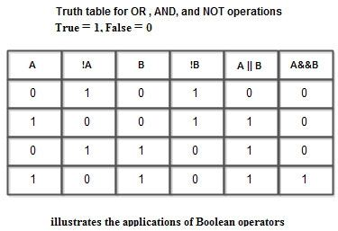
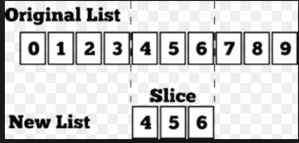
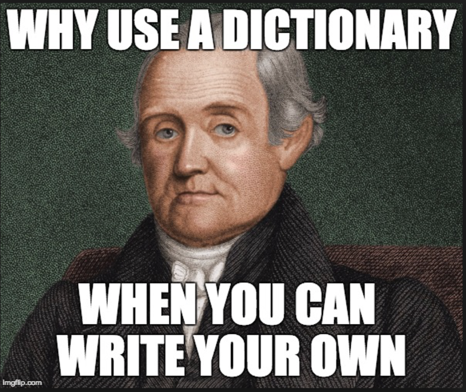
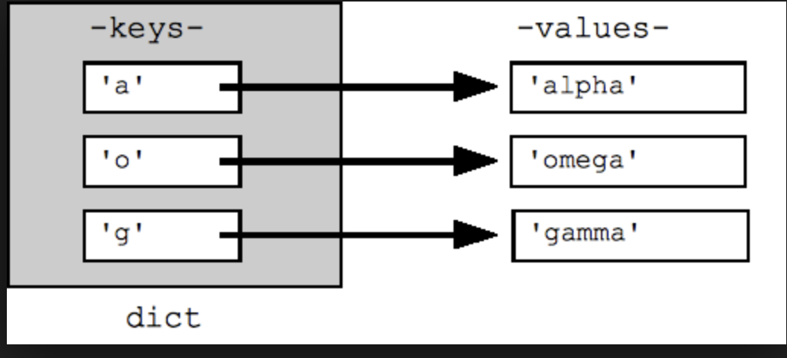
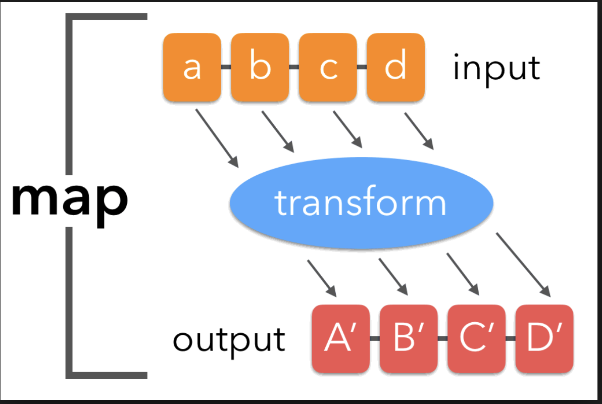

# Learn.py Session 2: Basics of Python - Functions and Data Structures

**Location**: Covel 227

**Time**: 6:15pm - 8:15pm, 17 April 2019

**Teacher**: Rajeshwari Jadhav

## Resources
**Slides**
* [Slides](https://docs.google.com/presentation/d/1Iq14IWk3ujO-NG1wfxyfph5ZCoHCmS0BkvXyi8AZ3Is/edit?usp=sharing)

**ACM Membership Attendance Portal**

* [Portal](https://members.uclaacm.com/login)

## What we'll be learning today
* Conditionals: Boolean operators
* Functions: review
* Conditionals: review
* Default parameters
* Lists
* Tuples
* Dictionaries
* Sets
* The map function

## Boolean Operators:

When you use boolean operators on two elements, the result evaluates to true or false.




```python
x = 1
y = 0

if x and y:
  print('both are true')
if x or y:
  print('one of them is true')
if not x:
  print('x is false')
```

You can use these in conditionals!

## Functions
Functions are parts of code that hold other lines of code, allowing us to call them with a simple call to the function, rather than repeatedly typing out the code inside. 

For example:
```python
def calculateGrade(m1, m2, final):
  return m1+m2+final

print(calculateGrade(58,79,99))
```

This function takes in three parameters, m1, m2, final and returns their sum. It prevents us from having to constantly type m1+m2+final for different values. 

What is return?
When we calculate the sum, we want to be able to access the result somehow.
When we say **return**, our function gives the result back to the programme, and we can access it easily by storing it in a variable, like this

```python
def calculateGrade(m1, m2, final):
  return m1+m2+final

total = calculateGrade(58,79,99)
print(total)
```

The variable **total** now holds the sum of the marks calculated by our function calculateGrade.

#### Scope
You may be wondering, why can't we just do the following?

```python
def calculateGrade(m1, m2, final):
  total = m1+m2+final

print(total)
```
In python, all your variables have a scope. 
The scope of a variable defines its visibility. If a variable is declared outside any condition or function or loop, like so:
```python
x = 5
print(x) #this works
```
it is said to have 'global scope', which means that every part of your code can use this variable. But if I define a variable inside a function, only my function can see that variable. For example, if I do the following
```python
def printNum():
  y = 5
  print(y)

printNum() #this works!
print(y) #this does NOT work!!
```
The variable 'y' is in the scope of the function printNum. However, its visibility is limited to that function. Nothing outside of that function can access 'y'. So, if I try to print y inside the function, I will get an output saying 5. 
But if I try to print the variable outside the function, outside its **scope**, I'll get an error, because at this point, my program does NOT know what 'y' is. This variable is essentially invisible to my code outside its scope. 
Syntactically, scope is defined by indentation in python. If you're familiar with C/C++, this is similar to using curly braces around functions or loops. 

So now that we understand how scope works, let's make our function slightly more useful, and get a quick review of conditional statements! So far our function only totals our marks and gives a score out of 300, but we want it to convert our scores to a grade. In this function, we will divide the totalMarks by 3 in order to find the average of the three marks. So let's make a function that converts scores out of 300 to a letter grade:

```python
def convertGrade(totalMarks):
  percent = totalMarks/3
  if percent >=93:
    return 'A'
  elif percent >=50:
    return 'B'
  else:
    return 'C'
```
So we've made our function. But how do we use it?

Python lets you call functions in other functions. This makes things efficient because you can make sure every function has its own characteristic. I want my convertGrade function to do just that, only convert the grade, nothing else. Instead of one complex function, I now have two simple functions!

So to convert my total to grades, I can just do the following:

```python
def convertGrade(totalMarks):
  percent = totalMarks/3
  if percent >=93:
    return 'A'
  elif percent >=50:
    return 'B'
  else:
    return 'C'

def calculateGrade(m1, m2, final):
  return convertGrade(m1+m2+final)

print(calculateGrade(58,79,99))#calling the function
```

Let's add some more functionality now. Someone who did not attend their final has no grade for the final. I want to be able to not pass **any** marks for the final and calculate the grade anyway. I can use a '**default parameter**', like this:

```python
def calculateGrade(m1, m2, final = 0):
  return convertGrade(m1+m2+final)

print(calculateGrade(58,79,99))
print(calculateGrade(58, 79))
```

**Output**<br>
B<br>
C

What's happening here?
In the first case, with 3 parameters, the function uses 99 as the final marks. But in the second case, we never pass the final scores. So the function notices this and uses the **default** marks we supplied, i.e., 0. So when the function calculates the total, the final marks are replaced by 99 in the first case, and 0 in the second case. 

## Lambdas
Lambdas are very simple functions that can be expressed in one line. 
For example, since I'm only using one line in this function:
```python
def calculateGrade(m1, m2, final = 0):
  return convertGrade(m1+m2+final)

calculateGrade(58,79,99)
```
We can represent this as a lambda function like this:
```python
calculateGrade = lambda m1, m2, final: convertGrade(m1+m2+final)

calculateGrade(58,79,99)
```
Lambda functions allow you to condense functionality in **one** line. 
You can have any number of parameters following the keyword **lambda**, but only one expression after the parameters. Once this expression is evaluated, the function returns the result of the expression. In this case, the expression is the call of another function, convertGrade, and it returns the result of this evaluation, that is, the letter grade returned by the function convertGrade. 

Now that we're comfortable enough with functions, we can move forward to some more complex ways of representing data. 

## List

A list is basically just that, a list of elements. 
The way I declare a list is with square brackets like this:
```python
myList = [2,4,'abc']
```
Python allows you to use multiple types inside the same list. You can make a list consisting of integers, strings, whatever you want! Let's explore what you can do with these structues. 
What if I want to make a list of the characters from friends? I'd do this:
```python
fam = ['Rachel', 'Ross', 'Phoebe', 'Monica']
```
So fam is a list of strings and I can use it to keep track of people. This can be pretty useful in a lot of ways. I can access any one of these elements using its index. Lists are ordered, meaning, I can index them. Note that ordered does NOT mean they are ordered alphabetically, it means the list can be indexed. In python, indexing starts from 0, at the position of the first element, and then goes on as 1, 2, 3... and so on. I can access a single element using its index and square brackets like this:

```python
fam = ['Rachel', 'Ross', 'Phoebe', 'Monica']
print(fam[0])
```
**Output**:<br> Rachel

Just like I can access the 0th element using these square brackets, I can also edit the elements, like this:

```python
fam = ['Rachel', 'Ross', 'Phoebe', 'Monica']
fam[2] = 'Princess Consuela'
```

Another super-useful way to use lists is using for loops. If I want to print out all their names, I don't have to do it individually. I can just do it with a for loop!

```python
fam = ['Rachel', 'Ross', 'Joey', 'Monica']

for name in fam:
  print(name)
```

**Output**:<br>
Rachel<br>
Ross<br>
Phoebe<br>
Monica

There are many useful methods that make using lists super effective in coding. Methods are essentially functions that can be called on the list, which are predefined and ready for us to use directly without worrying about the implementation. The way you call these functions is just by using the dot ('.') operator on the list. For example, I can add to the list after the initial declaration of the list by using the append function:

```python
fam = ['Rachel', 'Ross', 'Phoebe', 'Monica']
fam.append('Joey')

print(fam)
```
**Output**:<br>
Rachel <br>
Ross<br>
Phoebe <br>
Monica<br>
Joey

This will just append Joey to the end of the list. I can do the same for any other list I make: the dot operator is simply to access these inbuilt functions. Also notice that I used a new way of printing out a list here. Although intuitively, it makes sense to use a for loop and print each name, python doesn't make you do that for a list. It allows you to call print on the list directly and prints out every present element. 

It's also very easy to remove elements from a list, simply using the 'remove' function. 
For example, if I wanted to remove Rachel's name, I'd just do
```python
fam = ['Rachel', 'Ross', 'Phoebe', 'Monica']
fam.remove('Rachel')
print(fam)
```
**Output**:<br>
Ross<br>
Phoebe <br>
Monica<br>

Another interesting method to use with lists is extend. By using extend, you can append an entire list to another list and 'extend' the list, like so:

```python
fam = ['Rachel', 'Ross', 'Phoebe', 'Monica']
fam2 = ['Joey', 'Chandler'] #another list
fam.extend(fam2)

print(fam)
```
**Output**:<br>
Rachel <br>
Ross<br>
Phoebe <br>
Monica<br>
Joey<br>
Chandler

The way we use the extend function is by calling the method on the list we want to append to and passing the list we want to append as a parameter. So now you see that fam is extended to include the fam2 members. 

One really important attribute of a list is its length, and you can find the length by using the following len() function:
```python
fam = ['Rachel', 'Ross', 'Phoebe', 'Monica']

print(len(fam))
```
**Output**:
4

In addition to these, there are several other useful functions that you can check out at:
https://www.w3schools.com/python/python_ref_list.asp

Apart from the inbuilt methods that you can call on lists, there's another very useful concept: List comprehension.
### List Comprehension
List comprehension is a very concise way of creating a new list from an old list. It's super useful if you want to modify the elements of a list and store the modified elements in the second list. For example, consider a list of numbers. What if I wanted to, say, make another list of the squares of those numbers, but only if they were even numbers, and discard the odd numbers?
With the concepts we have learnt so far, one way to do this would be:
```
numList = [2,5,6,12,13]
squareList = [] #creating an empty list to store values in later

for number in numList:
  if number%2 ==0: #checking if it's even
    squareList.append(number*number)

for number in squareList:
  print(number)
```
**Output**:<br>
4<br>
36<br>
144

But these seems like a fairly large chunk of code. There is a way I can make this more concise, using **list comprehension**. 

To use list comprehension, you use the following syntax:
newList = [ **expression** for **i in oldList** if **condition** ]
It's easier to understand this using an example. Let us use the same example as above, of making a list of even square numbers, but with list comprehension. 

```
numList = [2,5,6,12,13]
squareList = [num*num for num in numList if num%2==0]

for number in squareList:
  print(number)
```
**Output**:<br>
4<br>
36<br>
144

Let us divide the list comprehension statement into three parts: the expression, the for loop, and the condition.
The expression dictates the modification you want to make to every element in your list. If I want to make the elements squared, I'll put num*num to give me num squared. 
The next section is the for loop, that goes through the entire list, just like our regular for loop. The final section is the if statement, which in this case is to check if the number is even. The way list comprehension executes is that for each element (for loop), it checks if the number is even (the condition) and then performs the modification (expression) on the element and appends it to the new list that we generated. 
So you can see how this may be useful: instead of having to write that huge block of code, you can just  condense it in one concise line! 

**Slicing**
Slicing is another amazing function that python allows you to use. To understand what slicing is, let's use this example:
```python3
numList = [24,36,45,76,88]
```
Now what if I want a subset of this list. I only want the three middle numbers (36, 45, 76). I can use slicing to get a list of these three numbers. Notice that this list that I want starts at position 1 (indexing begins at 0) and ends at position 3, **before** position 4. 
The way we can use slicing is as follows:
```python3
numList = [24,36,45,76,88]
newList = numList[1:4]

for number in newList:
  print(number)
```
**Output**:<br>
36<br>
45<br>
76



The first number in our slicing function, 1, is the starting index and the second number, is the ending index. These two are separated by a colon to let the computer know that they are separate indices. **The ending index is NOT included in the newList**. This means, that values indexed 1, 2, 3 are included, which means, (36, 45, 76) are included in newList.

Another cool function of slicing is that you can also determine the incrementing value of the indices. For example, if I wanted the numbers between indices 1 and 4, but only of every alternate index, I would want to increment my index jump by 2. I can sepcify this as follows:
```python3
numList = [24,36,45,76,88]
newList = numList[1:4:2]

for number in newList:
  print(number)
```
**Output**:<br>
36<br>
76

Here, in the line numList[1:4:2], the third parameter 2 is the value that we increment when we 'slice' the list. So, the number 36 at position 1 is added. The next number added is at position 1+2 = 3, which is 76. At this point, we stop because index 3 is the last index we want to have. Thus, newList contains 36 and 76, and skips 45. 

Another useful feature of this function is that it has default arguments for the starting and ending index, meaning that if we don't enter any arguments for the starting/ending index, it assumes that the starting index is 0 and the ending index is the index of the last element in the list. For example, if I wanted to get all elements from position 2 to the end, I would do:
```python3
numList = [24,36,45,76,88]
newList = numList[2:] #we enter no arguments here!

for number in newList:
  print(number)
```
**Output**:<br>
45<br>
76<br>
88

It is important to note that although we don't include arguments, we do include the : to separate the two arguments. I could also change the starting index and keep the ending index the default end by saying numList[2:].
This implies that we want it to slice considering position 2 as the start, and the end of the list as the end.
Thus, slicing can be super useful when we want to create new lists based on old lists!

## Tuple
Now if I want to make a list of elements that I don't want to change, ever, I can use another way of representing data called **tuples**. Tuples are basically just lists, except, I cannot change any element, add any element, remove any element or change the tuple in any way at all once I declare it. 
The way I can declare such a tuple is:
```python
fam = ('Rachel', 'Ross', 'Joey', 'Monica')
```
Notice that I used square brackets to declare a list, and round brackets for tuples.
So if I wanted to access an element in the tuple, 
```python
fam = ('Rachel', 'Ross', 'Joey', 'Monica')
print(fam[3])
```
**Output**: <br>Monica

However, if I were to try to add an element into this tuple, 
```python
fam = ('Rachel', 'Ross', 'Joey', 'Monica')
fam.insert('Phoebe') #gives me an error!!
```
I get an error, because the tuple is **unchangeable**, meaning I cannot add to it. Similarly, I cannot remove elements or change any element. For example, 
```python
fam = ('Rachel', 'Ross', 'Joey', 'Monica')
fam.remove('Monica') #gives me an error!! 
fam[2] = 'Joey' #gives me an error
```
So tuples can only be accessed, not modified and should only be used in cases where you don't want anyone changing your data. For those of you familiar with C/C++, this is like using const arrays!
Tuples also have some valuable methods, like index, which is the same as the index method for the list! You can find a list of these methods here:

https://www.w3schools.com/python/python_tuples.asp

Why would you want to use tuple, given that it's so rigid? When you don't want anyone touching the data you store, and you don't want any of your other functions to accidentally modify your data because it's important data, you would use tuple because this would prevent the programme from modifying the values stored in the tuple. 

## Dictionary





Lastly, we have another way to represent data, called dictionary. A dictionary is a collection of key-value pairs. Now what does that mean? 
A dictionary, just like sets, is not indexed by a position number, and is not ordered in any specific way. The way to access **values** in a dictionary is through the **keys** associated with them. For example, let's say the values I store in my dictionary are 'apple', 'banana', and 'cherry'. I will associate keys with these values: 'A' will be the key to the value 'apple', 'B' will be the key to the value 'banana' and 'C' will be the key to the value 'cherry'. 
Now, if I want to access the value 'apple', I can use its key 'A' to access the value 'apple'!



You can think about dictionary like the normal dictionary. We use a key, a word to find the meaning associated with it. Similarly, we use a key here to find the value associated with it. 
The way I can declare such a dictionary in Python is as follows:
```python
grades = {
  'CS' : 90,
  'GE' : 74,
  'Chem' : 56
}
```
In this dictionary, for every string on the left side, like Chem, I have a value associated with it that tracks the birthdays of these women. 
I cannot directly access 56, the Chem score, but I can use Chem, the key, to find the value, i.e. the score, associated with it. 
```python
grades = {
  'CS' : 90,
  'GE' : 74,
  'Chem' : 56
}
chemGrade = grades['Chem']
print(chemGrade)

```
Notice here, that just like we use the index to access an element in the list, for example, ```list[3]```, in dictionaries, we use the keys instead of the index of the position. Thus, in this example, I'm accessing the value associated with the key 'Chem' when I use 
```python3
grades['Chem']
```
and hence, the value 56 gets stored in my chemGrade variable.

In addition to accessing elements using the key, I can also use a for loop on the dictionary:
```python
grades = {
  'CS' : 90,
  'GE' : 74,
  'Chem' : 56
}
for x in grades:
  print(x) #this will print out all keys
for x in grades:
  print(grades[x])#this prints values associated with the keys
for x in grades.values():
  print(x)#this prints values associated with the keys

```
Consider the code block above. 
The first loop iterates through the list of keys in grades and so it prints out all the keys. The output for this will be:
CS
GE
Chem

As against this, in the second loop, we are printing out grades[x], which is a way to represent the **value** associated with the key x. So for every key x, the programme will print out the value associated with it. The output for this loop will be:
90
74
56

Thus, dictionaries can be used to associate one value to another.
We can also change what a certain key is associated with. For example, I can do the following:
```python3
grades = {
  'CS' : 90,
  'GE' : 74,
  'Chem' : 56
}
grades['Chem'] = 'fail'
```
grades['Chem'] = 'fail' changes the value associated with two from 56 to 'fail'.

Notice that it is very important to realise, that in a dictionary, every key needs to be unique. If the keys aren't unique, there could be two values associated with the same key, and the computer won't know which one to return. This is why the key must be unique. 

Dictionaries have many such interesting functions. You can find out more about them at:
https://www.w3schools.com/python/python_dictionaries.asp

But what if now I want something that has this attribute of unique keys, but is only a collection of unique keys, not associated values? The set is a data structure that has this property!

## Set
A set is similar to a list in that it can contain several elements. However, Sets are not ordered or indexed. This means that we cannot access the '0th or 4th' element of a set. The way sets are declared is similar to the way tuples or lists are declared, except they use **curly** braces. For example:
```python
fam = {'Rachel', 'Ross', 'Joey', 'Monica'}
print(fam[0])  #gives me an error as this set is not indexed
```
Hence, it makes sense for us to use sets when we don't require pulling individual elements out of our lists. However, we can still use loops on sets. For example, I can still do:
```python
fam = {'Rachel', 'Ross', 'Joey', 'Monica'}
for name in fam:
  print(name)  #this works!
```
**Output**:<br>
Rachel<br>
Ross <br>
Joey<br>
Monica

In addition to doing this, you can also check if a particular element is in the set. For example, I can do the following to check if Joey is in my set fam:
```python
fam = {'Rachel', 'Ross', 'Joey', 'Monica'}
if "Joey" in fam:
  print("How you doin")
```
**Output**:
How you doin

This means that even if we cannot index items in a set, we can use a for loop on it and we can also find out if an element is in the set. We can also add more elements to the set using the add function, like this:
```python
fam = {'Rachel', 'Ross', 'Joey', 'Monica'}
fam.add('Phoebe')
```
But then what makes sets useful? Sets have a very unique property:
**Sets do not allow duplicate elements**. 
For example, if I try to add another Ross to our fam, and print out fam
```python
fam = {'Rachel', 'Ross', 'Joey', 'Monica'}
fam.add('Ross')

print(fam)
```
**Output**:<br>
Rachel<br>
Ross<br>
Joey<br>
Monica

The output will **not** contain two mentions of Ross, they will only contain one. The computer will ignore that I added another Ross, as sets do not allow duplicates, and hence fam will not take the new Ross into account. 
It's important to notice here that my output for this program is unpredictable because the names can be listed in **any** order. This is because the Set is also **unordered**. If I run this programme twice, I may get two different sets of outputs, each in a different sequence. 
So where can sets be helpful?

We can take advantage of the fact that sets have unique elements, and use them when we want to ignore repetitions, in order to get a completely unique set!
Find out more about Sets and their methods here:
https://www.w3schools.com/python/python_sets.asp

## Map
Now that we know enough about basic data structures and functions, let's see how we can combine the two to make our even more efficient!
Let's go back to our grade calculator. So far, the calculator only finds the grades for one subject. If I wanted grades for all subjects, I would have to call the calculateGrade function on all my subject scores individually. Maybe, I could use a for loop for this:
```python3
scoreList = [35,99,78,90]

#consider the function calculateGrade takes in a score as its parameter
def calculateGrade (score):
  if score >=93:
    return 'A'
  elif score >=50:
    return 'B'
  else:
    return 'C'

gradeList = [] #create an empty list to store the results in later
for score in scoreList:
  grade = calculateGrade(score)
  gradeList.append(grade)

for grade in gradeList:
  print(grade)

```
**Output**:<br>
C<br>
A<br>
B<br>
B

But this seems a little lengthy. Lists are convenient in so many ways, but do we have to do all of this to just call a function on each of its elements? Is there a better way to do this?
There is! In python, there is a very useful function - the map function - that calls the function you input on every element of the list and returns another list of all the values returned by each call to the function on each element. For example:
```python3
scoreList = [35,99,78,90]

def calculateGrade (score):
  if score >=93:
    return 'A'
  elif score >=50:
     return 'B'
  else:
    return 'C'

```
Notice that the calculateGrade function we have written takes only one score. It is similar to the function we wrote for only one subject. We are **not** passing in the entire list as a parameter. However, we can pass the list as a parameter to the map function, and hence call calculateGrade on every individual element of our list. The map function thus takes two parameters: the function to be called on every element of the list, and the list itself. So we can do the following:
```python3
scoreList = [35,99,78,90]

def calculateGrade (score):
  if score >=93:
    return 'A'
  elif score >=50:
     return 'B'
  else:
    return 'C'
    
gradeList = map(calculateGrade, scoreList) #storing what is returned by map in a variable gradeList

for x in gradeList:
  print(x)
```
**Output**<br>
C<br>
A<br>
B <br>
B



As discussed, the map function also returns another list that stores the values returned by the call to calculateGrade on each element. Let's call this list that it returns, the result list. The map function iterates through the list. For the 0th element, i.e. 35, it calls the calculateGrade function passing 35 as a parameter and gets the result 'C'. It then stores this result as the 0th element of the result list. For the next element, i.e. 99, it calls calculateGrade by passing 99 as the parameter, and appends the result 'A' to the result list. This goes on until you reach the end of the  scoreList, and then result list is returned by the map function. The variable gradeList is then set to the result list, so that the value returned by map can be stored and used in the programme. 
Notice that this produces the same result as the for loop we tried, and so you can think about the map function as a function that is called in a loop on every element of a list. 
In addition to lists, we can also call map functions on tuples, sets, and dictionaries in a similar way! To find out more about the map function, visit:
https://www.geeksforgeeks.org/python-map-function/

Now you know enough about Python to take a shot at these fun challenges!

## Challenges:

## Level 1: Jace's Spells!

## Story
[Jace Beleren](http://media.wizards.com/2016/images/daily/cardart_OGW_Oath-of-Jace.jpg), a powerful mind mage is doing his thing on the mystical plane of Zendicar.  While he's doing his Jace things, he is confronted by a mysterious and threatening creature called a [Void Winnower](https://gatherer.wizards.com/Handlers/Image.ashx?multiverseid=402093&type=card). Oh no! What shall Jace do?! He **can't cast any of his his spells with even mana costs**! 

Jace constructs an elaborate plan to defeat the creature, but he needs your help to make sure none of the spells in his plan have even mana costs.  He can give you all of the costs in the form of a **list of integers**.  Your task is to **verify that everything in the list is even**.  Now, wip out your laptop and [defeat the Eldrazi menace](http://www.artofmtg.com/wp-content/uploads/2016/01/Bonds-of-Mortality-+-Fall-of-the-Titans-MtG-Art-Oath-of-the-Gatewatch-.jpg)!

## tdlr: The Actual Problem
Write a function called `iCantEven()`
* Parameters: One list of integers
* Return: A Boolean
    * `True` if there are **no even numbers** in the list
    * `False` in **every other case**

## Test Cases

| Test                     | Result  |
| :----------------------- | ------: |
| `iCantEven([])`          | `True`  |
| `iCantEven([0])`         | `False` |
| `iCantEven([1])`         | `True`  |
| `iCantEven([0,2])`       | `False` |
| `iCantEven([0,1,2,3])`   | `False` |
| `iCantEven([1,9,7,5,3])` | `True` |


## Level 2: List to Dict

### Part 1
Given 2 lists of the __same length__. 
Write a function `lists_to_tuples` that 
takes 2 lists `a` and `b` as arguments and
return a __list of tuples__ such that
each tuple is `(element from list a, element from list b)`.

**You have to use the `map` function
or use list comprehension.**

<details> <summary>Hint</summary>

Instead of using list comphresion on the inputs,  what if you use list comphresion on something like `len(a)`?

</details>

Example:
```python
a = ['name', 'age', 'food']
b = ['Galen', 19, 'Ramen']

result = lists_to_tuples(a, b)
print(result)
# should output:
# [('name', 'Galen'), ('age', 19), ('food', 'Ramen')]
```

### Part 2
Given a list of tuples.
Write a function `tuples_to_dict` that 
takes 1 list as argument and 
return a dictionary such that 
the first element of each tuple is the key
and the second element of each tuple is the corresponding value.

_You can use a loop for this one._

Example:
```python
t = [('name', 'Galen'), ('age', 19), ('food', 'Ramen')]

result = tuples_to_dict(t)
print(result)
# should output (order does not matter):
# {'name': 'Galen', 'age': 19, 'food': 'Ramen'}
```

### Part 3:
Write a function `lists_to_dict` 
that takes 2 lists of the same length and 
return a dictionary such that 
each entry in the first list is the key and
each entry in the second list is the corresponding value.

Example:
```python
a = ['name', 'age', 'food']
b = ['Galen', 19, 'Ramen']

result = lists_to_dict(a, b)
print(result)
# should output (order does not matter):
# {'name': 'Galen', 'age': 19, 'food': 'Ramen'}
```

You might use the result for the previous part on this one.

### Part 4 (Optional and Challenging):
Can you implement Part 2 without using a loop?

<details> <summary>Hint 1</summary>

Google `map`? 
Not the thing you use to navigate.
But a built in function called `map`.
Go Google it.

</details>

<details> <summary>Hint 2</summary>

In Python, you can define a function within a function.

</details>

<details> <summary>Hint 3</summary>

`map` does not execute right away. 
It returns an iterable and you need to do something with it.

</details>


## Level 3: Shakespearean Dictionary
## Overview
Now that you have had some practice with dictionary in Level 2, let's actually create a dictionary from scratch! Suppose you are in an English literature class and are studying a collection of Shakespeare's plays. As part of your assignment, you have to translate a few sentences from the plays into modern-day language. Your friends are struggling to complete the assignment but you came to Learn.py so you say "Ah ha! Why don't I use my knowledge from Learn.py lesson to help me and my friends out!" You want to create a dictionary mapping Shakespearean words into modern words using some vocabulary you noted down from class.

 

## Task
Implement a program that takes in a Shakespearean string from standard input and translates the string into modern-day language. 

You will have to implement a dictionary called **ShakespeareDict** from the following list of words that you found in your textbook from your English literature class. You will then use this dictionary to translate the provided strings in the assignment into modern-day language.

Your program should:
1. Input five strings from the assignment into your program.
1. Translate the strings using **ShakespeareDict** into modern-day language sentences.
1. Output the translated strings to the console.

Here is the list of words from your notebook, where the first represents the Shakespearean word and the second represents the modern translation of the word.

* art --> are
* ay --> yes
* be --> is
* doth --> does
* morrow --> tomorrow
* oft --> often
* till --> until
* wilt --> will
* thou --> you
* Thou --> You
* thine --> your

Here are the sentences in your assignment that you need to translate.

1. "Parting is such sweet sorrow, That I shall say good night till it be morrow” 
1. "The fool doth think he is wise, but the wise man knows himself to be a fool"
1. "Blow, blow, thou winter wind! Thou art not so unkind as man's ingratitude"
1. "This above all: to thine own self be true"
1. "Our doubts are traitors, and make us lose the good we oft might win, by fearing to attempt"

### Note
For the simplicity of this assignment, we will assume that users will put in valid strings only. If your program passes the fives sentences provided in this spec, you are considered to have completed this project!
### Hint
Use replace() to help your implementation :)


