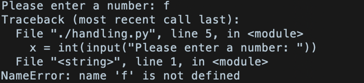
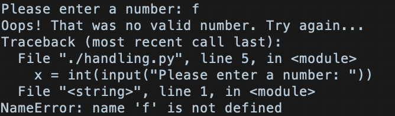

# Learn.py Session 3: Class/Objects, Modules, and File Handling

**Location**: Covel 227

**Time**: 6:15pm - 8:15pm, April 24, 2019

**Teacher**: Chayanis Techalertumpai

## Resources
**Slides**

**ACM Membership Attendance**

This is our third session of learn.py and today we will be talking about
* Classes/Objects
* File handling
* TryPy: try and except statements
* Modules and import
* How to install packages: pip

## Class/Objects
### Why do we need a class?
Suppose you want to create a variable type that stores name, age, and favorite food of a person. With what you know right now, you can create three separate variables like this:

```python
p1_name = "Furn"
p1_age = 20
p1_fav_food = "Kbbq"

```

However, we can see that the variables describing a single person `p1` are stored separately. Imagine having 10 people, we will have 30 lines of code just to describe them. Not too bad right? What if we have 100 people, we will need 300 lines of code just to store properties of every person. That's very repetitive and inefficient!

### What is a class?


Instead of having 300 lines of code, we can use a **class** to store all these **attributes** within a single variable called an **object**. 
So let's make sure we all understand these big words. Here we have a Person class which has three attributes: name, age, and favorite food. We can use this Person class to create Person objects. We can create as many objects as they want, and each of them will contain the three attributes define in our Person class. We can see that our object p2 has a name "thanos", an age of 110, and infinity stones as his favorite food. 

So now that we have a clearer idea of what these terms are, let's dive down to see what the actual code looks like.
Here is the simplest way we can do to declare our Person class.
```python
class Person:
    name = "blah"
    age = 12
    fav_food = "burger"
```
Now we can create a `Person` **object** called `p1`. 

```python
p1 = Person()
```

We can referencing the attributres of a `Person` object by using the syntax object.attribute_name
```python
print(p1.name)
print(p1.age)
print(p1.fav_food)
```
We can see that our `Person` object, by default, has a name "blah", age 12, and a fav_food "burger" as declared in the class definition.

However, this is bad practice because everyone not is called "blah" or is 12 years old. Why don't we just declare our `Person` class like this?

```python
class Person:
    name
    age
    fav_food
```

This will throw an error 
```python
NameError: name 'name' is not defined
```
because Python does not allow a user-defined class to have attributes without a value.

### `__init__()` function
A way to get around this is to use a built-in `__init__()` function. It is always executed when the class is being initiated (right at the beginning). `__init__()` is used to assign values to object properties.

```python 
class Person:
        def __init__(self, name, age, fav_food):
            self.name = name
            self.age = age
            self.fav_food = fav_food

 p1 = Person("Furn", 20, "Kbbq")
```
Now if we print attributes in `p1`, we will get "Furn", 20, and "Kbbq"!

We can also create methods in our class. Let's create a method called `birthday()` in our `Person` class where we will increment the age of the person by one.

```python
class Person:
    def __init__(self,namee,age,fav_food):
        self.name = name
        self.age = age
        self.fav_food = fav_food
    def birthday(self):
        self.age += 1
p1 = Person("Furn", 20, "Kbbq")
print(p1.age)
p1.birthday()
print(p1.age)
```
Here we can see that after calling `birthday()`, the age of `p1` increases from 20 to 21. So we can declare methods to modify attributes of a class. Our methods can also take in arguments. Inside our `Person` class, let's declare another method called `change_of_heart()` that takes in an argument called `new_fav_food` and changes the current fav_food of the person.
```python
    def change_of_heart(self, new_fav_food)
        self.fav_food = new_fav_food
        print('Yum!') 
```
Note that when we call this method with our `Person` object, we have to pass in one argument or we will get an error.
```python
p1.change_of_heart('Avocado toast')
```
Try this and see what happens!

The built-in data structures that we learned from the previous session such as list, set, and dictionary are also examples of a class. They also have built-in methods like `list.append()` or `set.add()`.


__Side note__: Notice that when we declare a method in a class, it takes in at least one argument, `self`. The `self` parameter is only a reference to the current instance of the class. It does not have to be named self and you can call it whatever you like but it has to be the first parameter of any function in a class. This will work just fine!
```python
class Person:
    def __init__(me, name, age, fav_food):
        me.name = name
        me.age = age
        me.fav_food = fav_food
    def birthday(uwu):
        uwu.age += 1
```

## File handling
Often times, we need to deal with files in our applications. We might have to read some data from a file to be used in our program or write some data generated by our program onto a file.
Here are some important operations on a file.
### Opening a file
**Syntax**: `open(filename, mode)`

Returns a **file object**, also called a handle.

A file object is another variable type that is specific to file handling.
You must open a file before doing anything else with it!
Example:
```python
f = open('workfile', 'w')
print f
```
There are four modes for opening a file:
* `'r'`: read; return error if file does not exist
* `'a'`: append; create file if file does not exist
* `'w'`: write; create file if file does not exist
* `'x'`: 'create'; return error if file exists
* `'+'`: use to specify more than one mode e.g. `'r+w'` means read and write.

### Methods for file objects
### write()
 We can use the write function to create and write into a file. Let's try creating a file called `file.txt` and specifying the mode to read and write.
 Note that if we use `'r+w'` we must create a file first because this mode will return error if the file does not exist.

 To create a file in command line:
 ```python
 $ touch file.txt
 ```
 Then in our Python code:
 ```python
 f = open('file.txt', 'r+w')
 f.write('Hello world\n')
 f.write('This is our new text file')
 ```
We can see that a `file.txt` file is created in our current directory and we can read the content of the file as well.
```python
$ ls
$ cat file.txt
```
If file.txt exists and is not empty, the `write` function will truncate the file and re-write all the contents in the file. If you want to keep the the old content, you must specifiy the `a` (append) mode when opening the file.
 
 ### read()
 * `f.read()` reads the entire file
 * `f.read(size)` reads at most `size` bytes
 
 Both `read()` functions return a string from corresponding file.

 If the end of file has been reached, `read()` returns an empty string.

Let's now try reading from a file we just created and write to.
```python
s = f.read()
print(s)
```
We can see that reading a file after writing it returns an empty line. We can fix this by using `seek()`

### seek()
We can change the file object's position using `seek(offset, from_what)` where

* `offset` = number of bytes to be added to a reference point
* `from_what` = specifying the reference  (or the starting position)
    * 0 = beginning of file
    * 1 = current file position
    * 2 = end of file

The default reference point is 0.

We often use `seek()` when we want to read or modify a single file multiple times. Whenever we `read()` or `write()` to the file, the file object is moved along its content.

So continuing from our example above, we can start reading from the beginning of the file by
```python
f.seek(0)
print(f.read(6))        # Returns 'Hello '
print(f.read())         # Returns 'world\n This is our new text file
```
### Closing a file
**Syntax**: `fileobj.close()`
We must close every file object we opened when we're done operating on a file to free up any system resources. After calling `close()`, any attempt to use the file object will fail.

It is good practice to use the `with` keyword when dealing with file objects to ensure that the file is properly closed after the user finishes using it.

```python
with open('file.txt', 'r+w') as f:
    read_data = f.read()
f.close()
```

To make sure we all understand how the file object works. Let's look at this animation. 
- The red arrow represents the file object f.
- When we call open, the file object is created at the beginning of file.txt
- When we write a string onto the file, f moves with it. Because of the newline character, f will end at the beginning of the second line.
- When we're done writing, f is at the end of file therefore any attempt to read here will return an empty string.
- We therefore have to use seek(0) to set f to the beginning of the file. 
- f.read(6) returns first 6 bytes (1 character = 1 byte) which is "Hello "
- f.read() returns the rest of the file
- The third f.read() returns an empty line

## TryPy: try and except statements
Syntax error is the most common cause of error which occurs before the program is executed. For example, if we execute our code
```python
while True
    print('Hello world')
```
Python will throw an error because of missing `:` after `True`
**Exceptions** are syntactic errors and sometimes they can be fatal. They occur during execution. Examples of exceptions are dividing by zero, undefined variable, and parsing string with integer. Most exceptions are **not** handled by programs and will look like this.



### Why do we need exception handling?

We can see that from this example, our program asks the user to input a number. If we input a letter, the program exists with an exception message.

However, we can handle these exceptions ourselves by using the `try` keyword. For example, instead of quitting the program, we can handle this exception by printing an error message and asking the user to input a number again.

```python
while True:
    try:
        x = int(input("Please enter a number: "))
        break
    except NameError:
        print("Oops! That was not a valid number. Try again...")
```
Now if we input a letter, we will no longer get the error and program will keep running until a valid number is entered.


Not only this is so much nicer than the default message, we can customize our program to behave like what we want even in the case where exceptions occur.

Exception handling allows you to do other things:
* We can ignore certain errors as long as they do not affect the correctness of your program with a `pass` keyword.
```python
except NameError:
    pass
```
* We can raise the exception message using the `raise` statement. When used with `except`, we can modify some data before exception occurs.
```python
except NameError:
    print('Oops! That was not a valid number. Try again...')
    raise
```
This is useful when you want to modify some variables or output some statements before the program exists with an exception.



However, `raise` must be used with caution because it is easy to mask a real programming error when it is used!

* A logic `try, except, else` is useful for code that must be executed if the `try` clause does not raise an exception. It is better than adding code to the `try` clause directly because it avoids accidentally catching an exception that wasn't raised by the code. The code will look something like this.

```python
try:
    ...
except:
    ...
else:
    ...
```

## Modules and import
Imagine writing a very large program. As a (good) programmer, you want to store your code into multiple files so your program is more readable and is easier to debug. Generally, we would have some file containing definitions of functions, classes, or variables to be used in the main program and one file containing the main program stating the logics of what to be done next. Those multiple files are called **modules**. They are called libraries in other languages like C, C++, Java.

### Why using modules?
Some functions are reusable e.g. generating a random number, calculating factorials, etc. but we don't want to write code for those every time we use it. We can therefore import some modules containing those functions into our program so we write shorter and more efficient code!

### How to use a module?
We need to **import** the module(s) we want to use into our Python script before using it. There are **A LOT** of Python standard modules out there to make your life as developer easier so you don't have to write things from scratch everytime.


We can import from a standard module or create your own module. To import a module, we use an `import` clause at the beginning of our script.

### User-defined module
Let's create our own `example` module in a file called `example.py` which contains simple `add`, `subtract`, and `multiply` functions. We will then import this `example` module into a separate file called `import.py`. Make sure that the two files are in the same directory!

*example.py*
```python
# Python Module example
def add(a, b):
    return a+b

def subtract(a, b):
    return a-b

def multiply(a, b):
    return a*b
```
*import.py*
```python
import example
print(example.add(4,5.5))
print(example.multiply(4,5.5))
```
We can also choose to import some functions but not all functions in a module.
*import.py*
```python
from example import subtract

print(subtract(4,5.5))
```
Note that we now do not have to reference the `subtract` function. In fact, using `example.subtract()` will throw an error because `example` is not defined in our program. Keep in mind that in this case, we cannot use `add` and `multiply` functions from our `example` module.

We can also use the clause `import ... as ...` to change the name of our module for referencing later on in our program.
```python
import example as x
print(x.add(4,5.5))
```

### Standard module
There are about 89,000 modules available in Python. 500 of them are available by default. So
if you are interested in Python standard modules, check this [link](https://docs.python.org/3/py-modindex.html) out!

Now I want to go over one module which you will use in your project for this session.

`NumPy` is a widely-used module. It's main purpose is to perform operations on multidimensional array (think matrices!). We can represent a 2x3 array in `NumPy` by
```python
[[1, 2, 3],
 [2, 2, 3]]
```
There are many cool operations in `NumPy` that you can use to modify multidimensional arrays and matrices.

### Decorators
Functions are objects in Python which means that they can be passed as argument to another function or defined inside another function. A **decorator** is like a wrapper of a function. It is useful because we can add certain behaviors to a function without permanently modifying it.

Let's look at a simple `introduce` function. Suppose we want to write a decorator for this function called `introduce_decorator`.

```python
# Function decorator
def introduce_decorator(func):
    print("Hi!")
    return func

# Actual function
def introduce():
    print("Nice to meet you.")

introduce()     # print "Nice to meet you."
```
To use a decorator, we must use the following syntax.
```python
introduce = introduce_decorator(introduce)
introduce()     # print "Hi!\nNice to meet you."
```
What if our actual function wants to take in argument(s)?
```python
def introduce_decorator(func):
    def inner(*args, **kwargs):
        print("Hi!")
        func(*args, **kwargs)
    return inner

@introduce_decorator
def introduce(name):
    print("My name is " + name + ". Nice to meet you.")

introduce("Furn")
```
__Side note__: `*args` and `kwargs` are special syntaxes in function definitions in Python. `*args` is used to pass a variable number of arguments to a function. For example, if we define our previous `add` function to take in `*args` argument, the function can take in any number of arguments.
`**kwargs` is used to pass a keyworded, variable-length argument list. A way to look at `kwargs` is that it is a dictionary that maps each keyword (argument) to the value that we pass with it.

Here is an example of a more complicated decorator example. We declare a decorator to time the time taken by any function passed into it. In this case, we are timing the factorial function.
```python
# Importing libraries
import time
import math

# decorator function
def calculate_time(func):
        def inner1(*args, **kwargs):
                begin = time.time()
                func(*args, **kwargs)
                end = time.time()
                print("Total time taken in : %s %02f") % (func.__name__, end - begin)
        return inner1

@calculate_time
def factorial(num):
        time.sleep(2)
        print(math.factorial(num))

factorial(10)
```

## pip
Suppose you write a very large application that includes many modules. As the number of modules grows, it becomes difficult to keep track of them, especially if they have similar names or functionality. You might wish for a means of grouping and organizing them.

**Packages** allow for a  hierarchical structuring of the module namespace using **dot notation**. They help avoid collisions between module names.

pip is a way of installing Python packages. Make sure that you can run `pip` from your command line by running
```bash
$ pip --version
```
If you installed Python from source (python.org) or Homebrew (for Mac users), you should already have `pip`. If `pip` isn't installed, first try to bootstrap it from the standard library by running
```
$ python -m ensurepip --default-pip
```
If this does not work, then run
```
$ wget https://bootstrap.pypa.io/get-pip.py
$ python get-pip.py prefix=/usr/local
```
Ensure that `pip` is up-to-date by
```
$ python -m pip install --upgrade pip setuptools wheel
```
To install some packages, we type
```
$ pip install <package_name>
```

# Challenges:
## Challenge 1: Philosopher thinking about himself?

Philosophers like to think about the world that they are in
and the meaning of being itself and other non-sense.
We want to simulate this behavior with Python.

Define a class named `Philosopher`.
Give it a name. Give it a function named `ponder`.
`ponder` should allow the philosopher to think about
the world it is in. 
The philosopher is very good and is able to see the 
world as a whole and annotate it. 
Therefore, `ponder` should print out the code that defines the `Philosopher` class and the `ponder` function. 

After the philosopher finish annotating this world,
he should print __its own name__ and `"If I annotated this world that I am in, then what am I? The maker of the world?"`

__TLDR__: In short, write a piece of code that prints itself.

Here is a skeleton for your code.
```python
class Philosopher:
    def __init__(self, name):
           # Your code here
    def ponder(self, name):
           # Your code here

aristotle = Philosopher('aristotle')
aristotle.ponder()
```

__The above code should print the following__
```
class Philosopher:
    def __init__(self, name):
           # Your code here
    def ponder(self, name):
           # Your code here

aristotle = Philosopher('aristotle')
aristotle.ponder()
aristotle
If I annotated this world that I am in, then what am I? The maker of the world?
```
I know, very meta isn't it?


## Challenge 2: U Can't Touch This.

[MC Hammer - U Can't Touch This](https://www.youtube.com/watch?v=otCpCn0l4Wo)

We learned about list in our previous sessions. 
If you access list passes its length, Python will throw an error.

```python
myList = [1, 2, 3]
print(myList[4])  # This will throw an error!!!
```

If senpai's code tries to access the list passes its length,
Python will not be happy and it will yell at you.
However, you can catch senpai doing nasty operation 
like accessing part of list that senpai is not supposed to 
access.

Given senpai's code, try to use a decorator 
`try-except` to catch senpai accessing the list out of index.

```python
def senpaisCode(somelist):
    # senpai got a bit too curious
    print('what is here at index 300000000?', somelist[300000000])

senpaisCode([1,2,3]) # this will throw an error
```

Use a `try-except` block for `senpaisCode`,
but catching the error and prints `"Senpai, u can't touch this"`,
when `senpaisCode` is called.

> senpai: A japanese word which describes an informal hierarchical interpersonal relationship found in organizations, associations, clubs, businesses, and schools in Japan.

## Challenge 3: MATH 33A?

Well, you are in this linear algebra class and the 
professor assigned you some matrix multiplication 
problem that you have to do by hand. You are lazy.
You heard that you can use some python package named
"numpy" to help you do those tedious Math.

Use the power of Google and learn how to use the numpy
package and do matrix multiplication in it.

Please solve the following problem with numpy.


 

