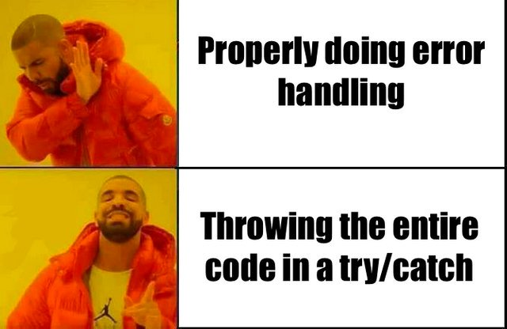
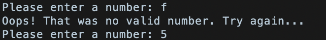
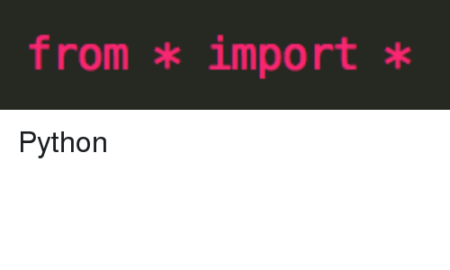
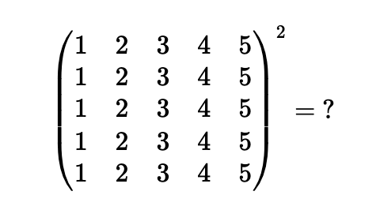

# Learn.py Session 3: Class/Objects, Modules, and File Handling

**Location**: Covel 227

**Time**: 6:15pm - 8:15pm, April 24, 2019

**Teacher**: Chayanis Techalertumpai

## Resources
**Slides**

**ACM Membership Attendance**

This is our third session of Learn.py and today we will be talking about
* Classes/Objects
* File handling
* Exception handling: try statement
* Modules and import statement

## Class/Objects
### Motivation:
Suppose we want to create a person variable who has a name, an age, and a favorite food. With what we know from the last two sessions of Learn.py, we can write a code like this:
```python
p1_name = "Iron man"
p1_age = 45
p1_fav_food = "cheese burger"
```

However, we can see that the variables describing a single person `p1` are stored separately. Imagine if you want to create 10 people in your program, you have to write 30 lines of code just to store their properties. What if you want to have 100 people? Your code is going to be very messy and inefficient. As a programmer, we care a lot about writing readable and scalable code.

A way to overcome this is to use a class.

### What is a class?


A class is simply a logical grouping of data and functions. Think of it as a "blue-print". A class is not something in itself. It simply describes how to make something. We establish that we can customize variable types stored in a class. Variables in a class are called **attributes**. We can also define functions within a class, called **methods**. Once we define our class, we can create a variable from the class, called an **object**. An object of a class contains properties and methods defined within that class. Each object is independent of each other.

So now that we have a clearer idea of what these terms are, let's dive down to see what the actual code looks like.
Here is the simplest way we can do to declare our Person class.
```python
class Person:
    name = "blah"
    age = 12
    fav_food = "ramen"
```
Now we can create a `Person` **object** called `p1`. 

```python
p1 = Person()
```

We can referencing the attributres of a `Person` object by using a **dot notation**. This is a way of telling Python that you want to read a value of what attribute from which object.
```python
print(p1.name)
print(p1.age)
print(p1.fav_food)
```
We can see that our `Person` object, by default, has a name "blah", age 12, and a fav_food "ramen" as declared in the class definition.

To change the values of these properties, we can do them one by one.
```python
p1.name = "Iron man"
p1.age = 45
p1.fav_food = "cheese burger"
```
However, this is very repetitive. Keep in mind that we want our program to be scalable, meaning that we want to be able to write a large program that can handle hundreds of thousands of people. Having to change the values of the attributes one by one is not efficient at all. Luckily, Python understands our pain and has a solution to this problem.

### `__init__()` function
We can use a Python built-in `__init__()` function to set the values of the attributes to whatever we want right when we declare an object. Notice that `__init__()` is short for **initialization** (Hint! It is indeed used to initialize objects) 

On one hand, the `__init__()` function is just like a good old function we learned about. It takes in parameters, do some modifications, and does not return anything. On the other hand, it is a special function inside a class (hence it is a **method**). It is special because we do not have to call it explicitly. Python will call the `__init__()` method automatically when we create an object of a class.

The `__init__()` method has a special parameter called `self` which basically describes the instance of the object that calls the method. Just like `__init__()`, we do not have to pass `self` explicitly as argument. Here is how we use the `__init__()` method.
```python 
class Person:
        def __init__(self, name, age, fav_food):
            self.name = name
            self.age = age
            self.fav_food = fav_food

 p1 = Person("Iron man", 45, "cheese burger")
```

This is a standard way of writing the `__init__()` method. It always takes in `self` as the first argument along with values for attributes inside your class which in this case is name, age, and fav_food. We notice the dot notation here again as our program is trying to tell Python "Hey! We want to change the name, age, and favorite food of this object we just created (aliased by `self`).

Now if we print the name, age, and fav_food of `p1`, we will indeed get "Iron man", 45, and "cheese burger"!
We can create as many objects of a class as we want and each one of them will have its own "memory". So let's say if we create 
```python
p2 = Person("Thanos", 110, "Infinity stones")
```

`p1` will not know anything about `p2` i.e. "Iron man" does not know that "Thanos" exists and is hungry for some infinity stones.

`__init()__` is one example of a method that we can create in a class. We can also create other methods. Since a class is like a collection of methods, we can create as many as we want. Let's now create a method called `birthday()` in our `Person` class that prints out `"Happy Birthday!"` and increments the person's age by one.

```python
class Person:
    def __init__(self,name,age,fav_food):
        self.name = name
        self.age = age
        self.fav_food = fav_food
    def birthday(self):
    	print("Happy Birthday!")
    	self.age += 1
p1 = Person("Iron man", 45, "cheese burger")
p2 = Person("Thanos", 110, "Infinity stones")
print(p1.age)
print(p2.age)
p1.birthday()
print(p1.age)
print(p2.age)
```
A few things to notice from this code:
1. Here we can see that after calling `birthday()`, the age of `p1` increases from 45 to 46 but the age of `p2` does not change. This again emphasizes that each object of a class is independent. Calling `birthday()` on `p1` only changes the attributes of `p1` and has nothing to do with `p2`.
1. This goes back to the meaning of the dot notation. It might not be clear in what the dot notation is for when we only have one object. However, if we have multiple objects, we must tell our program somehow which object we want to read the age from. 
1. *Any* method in a class (not just `__init__()`) **must** take in `self` as the first argument. The `self` argument is used when the method attempts to change or access the attributes of the class (using the dot notation).

Now let's try create another method that takes in an argument. We declare another method called `change_of_heart()` that takes in an argument called `new_fav_food` and changes the current fav_food of the person.
```python
    def change_of_heart(self, new_fav_food):
        self.fav_food = new_fav_food
```
Note that when we call this method with our `Person` object, we have to pass in one argument or we will get an error.
```python
p1.change_of_heart("avocado toast")
```
Try this and see what happens!

Remember `list`, a Python data structure that we learned from last session? We can integrate that with our `Person` class by creating a list of persons as well!

```python
person_list = []
person_list.append(p1)
person_list.append(p2)
print(person_list[0].name)
```

Wait a minute... Notice something similar between 

`p1.change_of_heart("avocado toast")` and `person_list.append(p2)`? 

They both use a dot notation to access some functions that modify the variable before the dot. 


`list` is also a class, but it is defined by Python!! Not only list, other data structures such as dictionaries, sets, tuples are all examples of classes. These classes also contain many methods for example `list.append()`, `tuple.insert()`, and `set.add()` and so on and so forth. 

So class is a concept that is used a lot in Python or any object-oriented programming languages (such as Java, C, C++). It is therefore important for you to have a good understanding of what it is and how to use it.

### Encapsulation
Another important programming concept that ties in nicely when we are talking about class is **encapsulation**. 

Formal definition: "the process of enclosing data and functions into a single unit called class."

Not very useful right?

Informal definition: an idea of 

## File handling
### Motivation:
Often times, we need to deal with files in our applications. 
Suppose we are writing a translator that translates Harry Potter books in any language to English. 
You might be wondering how are we going to input the entire book into our program? 
Telling a programmer to type the entire book in to the program sounds horrible.
Since the publishers should have electronic copies (.txt) of Harry Potter somewhere right. 
So why don't we just tell our program to read from those instead!

### How does our program read from a file?
How do you read from a file on ypur computer? You double click the file icon you want to read from to open the file. You then start reading the file, typically from the beginning to the end of file. You then close the file when you are done.
Our program does the same thing when we try reading from a file! Python provides functions that perform actions equivalent to what we do as human but in machine languages. Let's now learn about some operations we can perform on a file.


### Opening a file
**Syntax**: `open(filename, mode)`
The `open()` function returns a **file object**.
Just like human, our program has to open the file before reading or writing from it!

#### Side note: File object
Python provides a `File class` (Wow! Isn't that useful we just learned about classes!) for us to use in file handling. The class has various methods such as `open()`, `read()`, `write()`, and `close()`. It also contains an object called **file object** which is returned when calling `open()`. A file object is an example of encapsulation; it lets us read from and write to a file without concerning about what goes on under the hood. Reading and writing to a file involves some machine language instructions but we do not have to worry about that because the file object handles that for us.

There are four modes for opening a file:
* `'r'`: read; return error if file does not exist
* `'w'`: write; create file if file does not exist
* `'r+'`: read and write
* `'a'`: append; create file if file does not exist
* `'x'`: create; return error if file exists

### Closing a file
As human, when we are done reading and writing to a file we normally close the file to free up some system resources. Our program has to do the same thing. Pyhon provides a `close()` method which is equivalent to clicking the X button on the top right corner of your file to exit the file. A standard way of making sure that a file is properly closed after user finishes using to is to use the `with` keyword. We will show you how to use  `with` in the next example.

### Methods for file objects
### read()
To read from a file, we can use methods provided by Python.

`f.read()` reads the entire file and returns a string from the corresponding file.

 If the end of file has been reached, `read()` returns an empty string.

Let's now try reading from a file. First create a `file.txt` on your Desktop and input as content
```
Hello World!
This is our new text file.
```

We will then write a Python script to read from this file. Create a python script called `file_handling.py` on your Desktop which contains:
```python
with open('file.txt', 'r') as f:
    read_data = f.read()
    print(read_data)
```
We can see that `read_data` is a string containing the content of `file.txt` so when we print out this string, the content of the file is outputted to the console.

### readline()
We can also use the `readline()` method to read an entire line from a file. This is similar to `read()` but instead of reading the entire file at once, we only read a single line.
```
with open('file.txt', 'r') as f:
    line1 = f.readline()
    line2 = f.readline()
    print(line1 + line2)
```

### write()
We showed that we can read from a file. We can also write to a file, just like how human can also write to a file. Let's try create a new file `file2.txt` from our Python script.
```python
f2 = open('file2.txt', 'w')
f2.write('My name is Furn\n')
f2.write('I love Python!')
```

Now we can see that a file `file2.txt` has been created in our current directory! If we open this file, we can also see that it contains the sentences we typed in our `write()` method. Awesome!

## Exception handling: TryPy
What happens if we execute this code?
```python
while True
    print('Hello world')
```

Python will throw a syntax error because our code is missing `:` after `True`. Syntax errors are one of the most common sources of errors. However, another type of errors are called **exceptions**. They are run-time errors and sometimes they can be fatal. Examples of exceptions are dividing by zero, undefined variable, and parsing string with integer. This code will cause Python to throw an exception at us if we input anything that is not a number.
```python
while True:
	x = int(input("Please enter a number: "))
```

### Motivation:

We can see that from this example, our program asks the user to input a number. If we input a letter, the program crashes with an exception message.

However, there are times that we might not want our program to crash or exit. Imagine if you are writing a Python code for Facebook Ads, specifically for the section where users have to input their credit card number for making a purchase. If a user accidentally entered anything that is not a number, you don't want your application to crash and exit right? We can handle the exceptions and customize them to behave in the way we like with a `try/except` statement. For example, instead of quitting the program, we can handle this exception by printing an error message and asking the user to input a number again.

```python
while True:
    try:
        x = int(input("Please enter a number: "))
        break
    except:
        print("Oops! That was not a valid number. Try again...")
```

So in this program we can see that if the user correctly inputs a number, the statements under `try:` is executed and if the user inputs anything that is not a number (which will cause an exception), the statement under `except:` is executed.



The `try/except` statement not only makes our program looks nicer, it also allows us to customize our program to behave like what we want even in the case where exceptions occur.

## Modules and import statement
Imagine writing a very large program. As a (good) programmer, you want to group functions that do similar things into one file.
So our program will consist of multiple files which make it more readable and is easier to debug.
Generally, we would have some file containing definitions of functions, classes, or variables to be used in the main program and one file containing the main program stating the logics of what to be done next. 
Those multiple files are called **modules**. (If you know C or C++, they are called libraries!)

### Motivation
As we said earlier, breaking large program into multiple modules make the code easier to debug and more readable which will make you a good programmer!
Some functions are also reusable e.g. generating a random number, calculating factorials, etc. 
However, we don't want to write code for those functions every time we use them. 
We can therefore `import` modules containing the functions we need into our program so we write shorter and more efficient code!

### How to use a module?
We need to **import** the module(s) we want to use into our Python script before using it. There are **A LOT** of Python standard modules out there to make your life as developer easier so you don't have to write things from scratch everytime.



We can import from a standard module or create your own module. To import a module, we use an `import` clause at the beginning of our script.

### User-defined module
Let's first create and import our own simple module! We will create a `mathmod1` module that contains simple `add`, `subtract`, and `multiply` functions. 

*mathmod1.py*
```python
# Simple math functions that take in two arguments
def add(a, b):
    return a+b

def subtract(a, b):
    return a-b

def multiply(a, b):
    return a*b
```
We will then import this `mathmod1` module into our main program called `test.py`.
Make sure that the two files are in the same directory!

The `import` statement tells Python that we want to refer to the code in `mathmod1` file. 
When we use a function from `mathmod1`, we use a **dot notation** to tell Python (similar to how we use it in Class) that we want to use an `add` function from file `mathmod1`. 
If we just call `print(add(4,5.5))` Python will try to find definition of `add` within test.py (our local file) and will return error because we indeed did not define `add` in our test.py.


*test.py*
```python
import mathmod1

print(mathmod1.add(4,5.5))
print(mathmod1.multiply(4,5.5))
```
We can also choose to import some functions but not all functions in a module using a `from... import...` statement.

*test.py*
```python
from example import subtract

print(subtract(4,5.5))
```
Note that we now do **not** have to reference the `subtract` function. 
In fact, using `mathmod1.subtract()` will throw an error because `mathmod1` is not defined in our program. 
Keep in mind that in this case, we cannot use `add` and `multiply` functions from our `mathmod1` module because our program is only aware of `subtract` and nothing else.

We can also use the clause `import ... as ...` to change the name of our module for referencing later on in our program.

*test.py*
```python
import mathmod1 as m1

print(m1.add(4,5.5))
```

Let's now create another module called `mathmod2` that also contains `add`, `subtract`, and `multiply` functions but with three arguments.

*mathmod2.py*
```python
# Simple math functions that take in three arguments
def add(a, b, c):
    return a+b+c

def subtract(a, b, c):
    return a-b-c

def multiply(a, b, c):
    return a*b*c
```

Now in our `test.py` we can import these two modules.

*test.py*
```python
import mathmod1 as m1
import mathmod2 as m2

sum1 = m1.add(4, 5.5)
sum2 = m2.add(4, 5.5, 10)
```

Notice that we can call `add` with both two and three arguments because even though they have the same name, they are two different function declared in two different modules.
This is another reason we need to use the **dot notation** to tell our program to read the function from which module.

### Standard module
There are about 89,000 modules available in Python. 500 of them are available by default. So
if you are interested in Python standard modules, check this [link](https://docs.python.org/3/py-modindex.html) out!

Let's try importing some simple standard module called `math`. 
We can do some cool things with it such as printing the value of `pi` or calculating the value of 5^5.

*test.py*
```python
import math

print(math.pi)
print(math.pow(5,5))
```
------ Topics below are not covered in learn.py session 3 but are in the README for those who are interested in learning more

### Decorators
Functions are objects in Python which means that they can be passed as argument to another function or defined inside another function. A **decorator** is like a wrapper of a function. It is useful because we can add certain behaviors to a function without permanently modifying it.

Let's look at a simple `introduce` function. Suppose we want to write a decorator for this function called `introduce_decorator`.

```python
# Function decorator
def introduce_decorator(func):
    print("Hi!")
    return func

# Actual function
def introduce():
    print("Nice to meet you.")

introduce()     # print "Nice to meet you."
```
To use a decorator, we must use the following syntax.
```python
introduce = introduce_decorator(introduce)
introduce()     # print "Hi!\nNice to meet you."
```
What if our actual function wants to take in argument(s)?
```python
def introduce_decorator(func):
    def inner(*args, **kwargs):
        print("Hi!")
        func(*args, **kwargs)
    return inner

@introduce_decorator
def introduce(name):
    print("My name is " + name + ". Nice to meet you.")

introduce("Furn")
```
__Side note__: `*args` and `kwargs` are special syntaxes in function definitions in Python. `*args` is used to pass a variable number of arguments to a function. For example, if we define our previous `add` function to take in `*args` argument, the function can take in any number of arguments.
`**kwargs` is used to pass a keyworded, variable-length argument list. A way to look at `kwargs` is that it is a dictionary that maps each keyword (argument) to the value that we pass with it.

Here is an example of a more complicated decorator example. We declare a decorator to time the time taken by any function passed into it. In this case, we are timing the factorial function.
```python
# Importing libraries
import time
import math

# decorator function
def calculate_time(func):
        def inner1(*args, **kwargs):
                begin = time.time()
                func(*args, **kwargs)
                end = time.time()
                print("Total time taken in : %s %02f") % (func.__name__, end - begin)
        return inner1

@calculate_time
def factorial(num):
        time.sleep(2)
        print(math.factorial(num))

factorial(10)
```

## pip
Suppose you write a very large application that includes many modules. As the number of modules grows, it becomes difficult to keep track of them, especially if they have similar names or functionality. You might wish for a means of grouping and organizing them.

**Packages** allow for a  hierarchical structuring of the module namespace using **dot notation**. They help avoid collisions between module names.

pip is a way of installing Python packages. Make sure that you can run `pip` from your command line by running
```
$ pip --version
```
If you installed Python from source (python.org) or Homebrew (for Mac users), you should already have `pip`. If `pip` isn't installed, first try to bootstrap it from the standard library by running
```
$ python -m ensurepip --default-pip
```
If this does not work, then run
```
$ wget https://bootstrap.pypa.io/get-pip.py
$ python get-pip.py prefix=/usr/local
```
Ensure that `pip` is up-to-date by
```
$ python -m pip install --upgrade pip setuptools wheel
```
To install some packages, we type
```
$ pip install <package_name>
```

# Challenges:
## Challenge 1: Philosopher thinking about himself?

Philosophers like to think about the world that they are in
and the meaning of being itself and other non-sense.
We want to simulate this behavior with Python.

Define a class named `Philosopher`.
Give it a name. Give it a function named `ponder`.
`ponder` should allow the philosopher to think about
the world it is in. 
The philosopher is very good and is able to see the 
world as a whole and annotate it. 
Therefore, `ponder` should print out the code that defines the `Philosopher` class and the `ponder` function. 

After the philosopher finish annotating this world,
he should print __its own name__ and `"If I annotated this world that I am in, then what am I? The maker of the world?"`

__TLDR__: In short, write a piece of code that prints itself.

Here is a skeleton for your code.
```python
class Philosopher:
    def __init__(self, name):
           # Your code here
    def ponder(self, name):
           # Your code here

aristotle = Philosopher('aristotle')
aristotle.ponder()
```

__The above code should print the following__
```
class Philosopher:
    def __init__(self, name):
           # Your code here
    def ponder(self, name):
           # Your code here

aristotle = Philosopher('aristotle')
aristotle.ponder()
aristotle
If I annotated this world that I am in, then what am I? The maker of the world?
```
I know, very meta isn't it?


## Challenge 2: U Can't Touch This.

[MC Hammer - U Can't Touch This](https://www.youtube.com/watch?v=otCpCn0l4Wo)

We learned about list in our previous sessions. 
If you access list passes its length, Python will throw an error.

```python
myList = [1, 2, 3]
print(myList[4])  # This will throw an error!!!
```

If senpai's code tries to access the list passes its length,
Python will not be happy and it will yell at you.
However, you can catch senpai doing nasty operation 
like accessing part of list that senpai is not supposed to 
access.

Given senpai's code, try to use a decorator 
`try-except` to catch senpai accessing the list out of index.

```python
def senpaisCode(somelist):
    # senpai got a bit too curious
    print('what is here at index 300000000?', somelist[300000000])

senpaisCode([1,2,3]) # this will throw an error
```

Use a `try-except` block for `senpaisCode`,
but catching the error and prints `"Senpai, u can't touch this"`,
when `senpaisCode` is called.

> senpai: A japanese word which describes an informal hierarchical interpersonal relationship found in organizations, associations, clubs, businesses, and schools in Japan.

## Challenge 3: MATH 33A?

Well, you are in this linear algebra class and the 
professor assigned you some matrix multiplication 
problem that you have to do by hand. You are lazy.
You heard that you can use some python package named
"numpy" to help you do those tedious Math.

Use the power of Google and learn how to use the numpy
package and do matrix multiplication in it.

Please solve the following problem with numpy.




 

