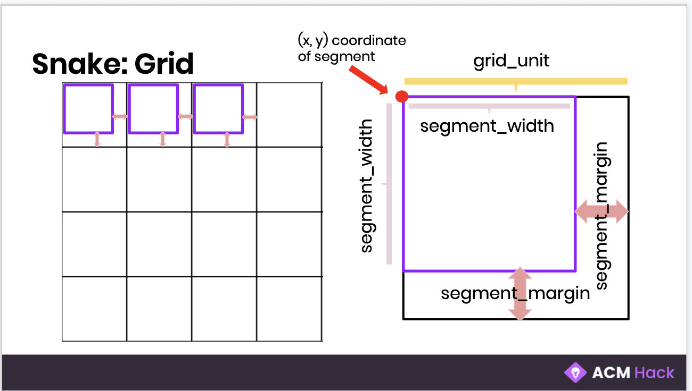

# Learn.py Session 4 Applications of Python: Pygame

**Location:** Covel 227

**Time:** 6:15pm - 8:15pm, 1 May 2019

**Teacher:** Jody Lin

## Resources
**Slides**
* [Slides](https://docs.google.com/presentation/d/1OyohvAX0Ly5ZxzpqL6ZVAXHFLeteTg2at_xfQl_oDk8/edit#slide=id.p1)

**ACM Membership Attendance Portal**

* [Portal](https://members.uclaacm.com/login)

## What we'll be learning today
* Installing and managing packages with pip
* Using pygame to make games with python!

## Installing packages:

We know that we can use modules to access functions from code that other people have written for us instead of having to write it ourselves again. But what if you have too many modules because you're application is very complex? This is when you use a **package** of modules. Pip is a way to install these packages. Today, we're going to be working with the pygame package, and you will need to install that package using pip. To do this:

### Mac:
* Open your terminal
* Type pip3 install pygame
### Windows:
* Open Powershell or Command prompt
* Type pip install pygame

## The Game

We're going to make our very own snake game today! Our snake will be able to eat food and increase its length and score, but can die if it collides with the walls (or with itself!)

## The Setup

Our snake will consist of several square shaped segments moving together in a line on the grid. If the snake is growing, a segment will be added.

In order to make our snake move around, grow, and look like a snake, we'll be experimenting around with a few variables that we will define as the following:




## The code:

If at any point during the workshop you need to refer to the code, this is the code to the entire game!

```python3
import pygame

from random import randint

# --- Globals ---
# colors we'll use in our game
BLACK = (0, 0, 0) # background color
WHITE = (255, 255, 255) # snake's color
PINK = (255, 77, 255) # food color
GREEN = (10, 255, 37) # score color
RED = (255, 10, 37) # game over color

# dimensions (width = height) of each snake segment block
segment_width = 15
# spacing between each segemnet of the snake
segment_margin = 3
# if we visualize our game on a grid, each segment_width and segment_margin make up
# a single unit of the grid
grid_unit = segment_width + segment_margin

# the initial speed of our snake
x_change = grid_unit
y_change = 0

# Sprite is a general term for an object on the screen that can move around.
# We can animate sprites, control their movement, and have them interact with other sprites
# Keep in mind that sprites are objects, which means this one item can hold multiple data

# pygame.sprite.Sprite is a simple base class for visible game objects

# Here, we create a new class called Segment and it's going to be our python sprite (the snake moving around our screen)
# We put in pygame.sprite.Sprite to state that this class will be based on Pygame's pre-defined Sprite class
class Segment(pygame.sprite.Sprite):
  def __init__(self, x, y):
    super(Segment, self).__init__()

    # this creates the segment to be a Surface object (aka any image)
    # In our case, this image is a square with side-length = segment_width
    # We also color fill this square with the color WHITE
    self.image = pygame.Surface([segment_width, segment_width])
    self.image.fill(WHITE)

    # this stores the (x, y) coordinates of the segment
    self.rect = self.image.get_rect()
    self.rect.x = x
    self.rect.y = y

# Here, we create a new class called Food that will be the food that our snake eats throughout the game
class Food(pygame.sprite.Sprite):
  def __init__(self):
    super(Food, self).__init__()

  # this creates the food object to be a Surface object much like our Segment objects
  # We color our food PINK
  self.image = pygame.Surface([segment_width, segment_width])
  self.image.fill(PINK)

  # this stores the (x, y) coordinates of the food
  self.rect = self.image.get_rect()
  self.rect.x = self.randomCoord(screen.get_width())
  self.rect.y = self.randomCoord(screen.get_height())

  # this function will return us a random coordinate on our grid
  # this function also ensures the coordinate returned will not be off-screen
  def randomCoord(self, upperBound):
    coord = randint(0, upperBound//(grid_unit)-1 ) * grid_unit
    return coord

  # when we call this function, we'll move the food to a new random location on our screen
  def eaten(self):
    self.rect.x = self.randomCoord(screen.get_width())
    self.rect.y = self.randomCoord(screen.get_height())

# Here, we create a class that will keep track of our score
# This class will also display our score and display our game over screen
class GameStats:
  def __init__(self, score = 0):
    self.score = score

  # this function will increase our score by 1
  def increaseScore(self):
    self.score +=1

  # this function will display our score
  def displayStats(self):
    text = 'Score: ' + str(self.score)
    fw, fh = font.size(text)
    surface = font.render(text, True, GREEN)
    screen.blit(surface, ((screen.get_width() - fw)//2, 10))

  # this function will display our game over screen with our final score
  def gameOver(self):
    screen.fill(BLACK)
    text = 'Game Over'
    fw, fh = font.size(text)
    surface = font.render(text, True, RED)
    screen.blit(surface, ((screen.get_width()- fw)//2, 140))

    textScore = 'Score: ' + str(self.score)
    fw, fh = font.size(textScore)
    surface = font.render(textScore, True, RED)
    screen.blit(surface, ((screen.get_width() - fw) //2, 170))


# --- Game Initialization ---
# pygame.display.set_mode will initialize a window/display for the game. We're going to make this a 800 by 600 pixel screen
screen = pygame.display.set_mode([540, 360])
# pygame.display.set_caption sets the title we see on top of the window
pygame.display.set_caption('Snake Game')
# pygame.time.Clock() creates an object for us to keep track of time
clock = pygame.time.Clock()
# these two functions intialize and set up font that we use in our GameStats class
pygame.font.init()
font = pygame.font.SysFont('mono', 24, bold=True)


# --- Object Initalization ---
# By creating allspriteslist, we group together sprites
# so we can act on them at the same time rather than doing it one by one,
# which would be very tedious if we have many sprites
allspriteslist = pygame.sprite.Group()

# We will store each of the segments of our snake in this list
snake_segments = []

# this loops 3 times and adds 3 segments to our snake_segments list
for i in range(3):
  # This increment will set the segments properly next to each other as the snake keeps growing
  # y remains the same because we are going to first create the snake horizontally straight so that it is on the same y-axis
  x = 252 - (segment_width + segment_margin) * i
  y = 36
  # We initialize a segment of the snake using these coordinates and our Segment class
  segment = Segment(x, y)

  # We add the current segment to our snake list
  snake_segments.append(segment)
  # We add the current segment to our sprites list
  allspriteslist.add(segment)

# creates a single Food object
food = Food()
# adds our food object to our allspriteslist Group
allspriteslist.add(food)

# initializes our GameStats class
gamestats = GameStats()

# --- Run our Snake game ---
# indicates whether the player has wants to exit or dies in our game
done = False

# this loop runs the entire game
# each time this loops, our screen is updated
while not done:

  # this checks if the user hits the exit button or presses an arrow key
  for event in pygame.event.get():
    if event.type == pygame.QUIT:
      pygame.quit()

    if event.type == pygame.KEYDOWN:
      if event.key == pygame.K_LEFT:
        x_change = (grid_unit) * -1
        y_change = 0
      if event.key == pygame.K_RIGHT:
        x_change = (grid_unit)
        y_change = 0
      if event.key == pygame.K_DOWN:
        x_change = 0
        y_change = (grid_unit)
      if event.key == pygame.K_UP:
        x_change = 0
        y_change = (grid_unit) * -1

  # checks if new position will overlap with Food
  # if it does, it will NOT remove the last segment (snake grows)
  if snake_segments[0].rect.x == food.rect.x and snake_segments[0].rect.y == food.rect.y:
    food.eaten()
    gamestats.increaseScore()
  else:
    # Get rid of last segment of the snake
    # .pop() command removes last item in list
    old_segment = snake_segments.pop()
    allspriteslist.remove(old_segment)

  # Determine location of new segment and create segment
  x = snake_segments[0].rect.x + x_change
  y = snake_segments[0].rect.y + y_change
  segment = Segment(x, y)

  # Insert new segment into the list and group
  snake_segments.insert(0, segment)
  allspriteslist.add(segment)


  first_segment = snake_segments[0].rect
  # break out of loop if snake goes out of the screen
  if first_segment.x < 0 or first_segment.x > screen.get_width():
    break
  if first_segment.y < 0 or first_segment.y > screen.get_height():
    break

  # end the loop if snake runs over itself
  for seg in snake_segments[1:]:
    if first_segment.x == seg.rect.x and first_segment.y == seg.rect.y:
      done = True
      break

  # --- Draws everything ---
  # Clears the screen (by covering it all with black)
  screen.fill(BLACK)

  # draw all our snake segments and food
  allspriteslist.draw(screen)

  # Stats
  gamestats.displayStats()

  # tells our display to show our changes
  pygame.display.flip()

  # pauses the loop briefly
  clock.tick(5)

# game over message displayed until exit button is clicked
exit = False
while not exit:
  for event in pygame.event.get():
    if event.type == pygame.QUIT:
      pygame.quit()
  pygame.display.flip()
  gamestats.gameOver()

# allows us to close our pygame display
pygame.quit()
```

## Challenges:

### Level 1: Yum!

Change the color of the food after it is eaten.
For example, the food may first be pink, but after it is eaten, when the food is relocated, it will be a different color (i.e. blue).

### Level 2: No turning back!

Currently, the snake can turn 180 degrees on itself.
However, imagine a snake (or any animal for that matter) turning its head 180 degrees into its body (or maybe don't because its morbid). This just doesn't make too much sense. Let's prevent this from ever happening. Your job is to fix this issue so that if a player tries to 180 on themselves, they game won't let them. If a player does try to 180 into themselves, the snake will instead continue in the direction that it is currently going.
For example, if the snake is moving right, it should not be able to directly move left even if we press the left key.

### Level 3: Poison!

Lay out poison blocks for the snake to avoid.
The poison block should occur in a random coordinate.
If the snake encounters the poison, the score will decrease and the snake will lose a segment of its body.
When the poison is eaten, another poison block will occur at a random coordinate.
There will always be one poison block on the screen to avoid.
Note that the snake cannot be only one segment.
If the snake is two segments long and hits poison, the game will end.
