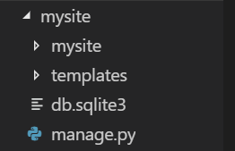

# Learn.py Session 5 Application of Python: Web Development Part 1

**Location:** Covel 227

**Time:** 6:15 PM - 8:15 PM, 15 May 2019

**Teacher:** Connie Chen

## Resources
**Slides**

**ACM Membership Attendance Portal**

**Additional Learning Materials**

* For more on web dev, check out our fall workshop series, Hackschool! https://github.com/uclaacm/hackschool-f18

## What we'll be learning today
* How does the ~web work?
* What is HTML/CSS?
* Intro to Django - a Python web framework!

The demo today will have quite a few files and directories - if you fall behind at any moment, check out the completed demo code in the repo, or ask a mentor for help!

## What you'll need:
* A text editor (like Sublime or VS Code)
* Python
* Django

### Windows:
* Open Powershell/Command Prompt
* `pip install django`

### Mac:
* Open Terminal
* `pip install django`

### Did it work?
* `python -m django --version`

This should output the version of Django you have installed.

Now let's get started!


## How does the ~web work?

TODO

## What is HTML/CSS?

TODO

**Creating our first HTML file**

Let's create an HTML file called `index.html`

```HTML
<!DOCTYPE html>
<html>
    <head>
        <title>Cool Things</title>
    </head>
    <body>
        <h1>What cool things you can do with the web...?</h1>
        <ul>
            <li>You can create lists :o</li>
            <li>~Dark Mode</li>
        </ul>
        <p>And HTML and CSS can do way more than that! Colors, images, 
            <a href="https://coolcssanimation.com">animations</a>, and <a href="https://fonts.google.com">fonts</a> are only the tip of the iceberg!
        </p>
        
    </body>
</html>
```
TODO: Go over each of the tags

Now if we open `index.html` file from our file explorer, we should be able to see the webpage! But, it doesn't look that great. This is where CSS comes in! 

**Creating our first CSS file**

In the same directory that `index.html` is located, let's create `style.css`

```css
body {
    text-align: center;
    font-family: 'Noto Sans', sans-serif;
}

ul {
    display: inline-block;
    text-align: center;
}

h1 {
    font-size: 200%;
    font-weight: bold;
}
```

TODO: Explain some of the CSS stuff

Great, now we have the CSS file! But what's the point if our HTML file doesn't use it? 

To link the HTML and CSS file, add this inside the `head` tag in `index.html`

```HTML
<link href="https://fonts.googleapis.com/css?family=Noto+Sans" rel="stylesheet">
<link rel="stylesheet" href="static/css/style.css"/>
```

TODO: Explain this, and where the fonts.googleapis.com link came from?

Try opening `index.html` now!

## Intro to Django

Now we have a beautiful HTML file. But, we can only serve one at a time. How can we serve multiple files at the same time? This is where Django comes in

TODO: Explain Django

Let try using Django!

**Setting up our project**

Django makes it really easy to get a web application up and running. Make sure you're in the directory you want to create your project in (preferably in the same directory as `index.html` and `style.css`), then type:

`django-admin startproject mysite`

To start the server and get the web app running, `cd` into the directory that was just created and type:

`python manage.py runserver`

TODO: go to localhost:8000 wow

Now we can start by linking the HTML file we just created.

Recall that web pages are served by the client sending a request to the server, and the server sends a response back (with the webpage we requested, hopefully). But we currently don't have any way to handle that exchange, so let's write a function to do that!

Create a file called `views.py` in the `mysite` directory

```python
from django.shortcuts import render, render_to_response

def home_page(request):
    return render(request, 'index.html')
```

TODO: explain that

Wait, but our project currently doesn't know where to find `index.html`! It's not even in our project directory! 

We could just move it into the top-level `mysite` directory, but we will most likely end up having many many HTML files in our project. So let's create a separate directory for our HTML files, called `templates`

This is what your file directory should look like:



Move `index.html` inside that directory.

Now we have our HTML files organized nicely in our project hierarchy, but Django doesn't know to look there for our files! To fix that, go to `settings.py` in the lower-level `mysite` directory, find the `TEMPLATES` variable, and modify it so it looks like this:

```python
TEMPLATES = [
    {
        'BACKEND': 'django.template.backends.django.DjangoTemplates',
        'DIRS': [os.path.join(BASE_DIR,'templates')],
        'APP_DIRS': True,
        'OPTIONS': {
            'context_processors': [
                'django.template.context_processors.debug',
                'django.template.context_processors.request',
                'django.contrib.auth.context_processors.auth',
                'django.contrib.messages.context_processors.messages',
            ],
        },
    },
]
```

TODO: Explain the DIRS thing

Now that we're ready for the server's response, how do we send the request? Through URLS!

Find the file `urls.py` in the `mysite` directory, and modify it so it looks like this:

```python
from django.contrib import admin
from django.urls import path

from . import views

urlpatterns = [
    path('admin/', admin.site.urls),
    path('', views.home_page),
]
```

TODO: explain this. This should work (except CSS)

You might've noticed that all the hard work we put into styling `index.html` has disappeared. Like before, Django doesn't know about our CSS file! 

Create a directory called `static`, in the same directory as our `templates` directory, and in there, create a directory called `css`. Move `style.css` into this directory.

> That seems like a lot of directories for just one file. And you're right, but, static files encompass more than just CSS files - image files are another example. While it may seem like overkill for this demo, it's a good idea to practice organizing your files this way. 

To make sure Django knows to look there for all static files in the future, go to `settings.py`, and add this to the bottom of the file:

```python
STATICFILES_DIRS = (
    os.path.join(BASE_DIR, 'static'),
)
```

TODO: explain that

TODO: this should work

**Serving multiple webpages**

We want to use Django for many reasons, but one of them is so that we can serve multiple webpages. Let's do that now.

Create two new HTML files in `templates/`, like so:

```HTML
<!-- Call this darkMode.html -->
<!DOCTYPE html>
<html> 
    <head>
        <link href="https://fonts.googleapis.com/css?family=Noto+Sans" rel="stylesheet">
        <title>Dark mode</title>
    </head>
    <body>
        <h1>Come to the dark side...</h1>
    </body>
</html>
```

```HTML
<!-- Call this piktures.html -->
<!DOCTYPE html>
<html>
    <head>
        <link href="https://fonts.googleapis.com/css?family=Noto+Sans" rel="stylesheet">
    </head>
    <body>
        <h1>Surfing Pikachu</h1>
        <p>I wish I knew how to surf, although not with Pikachu</p>
        
    </body>
</html>
```
TODO: Quick recap of the HTML tags?

Let's put our CSS knowledge to good use, and style these pages. We want to create separate CSS files for each, so create them in the `static/css/` directory:

```CSS
/* Call this darkMode.css */
body {
    text-align: center;
    font-family: 'Noto Sans', sans-serif;
    background-color: #303030;
    color: white;
}
```

```CSS
/* Call this piktures.css */
body {
    text-align: center;
    font-family: 'Noto Sans', sans-serif;
}

ul {
    display: inline-block;
    text-align: center;
}

h1 {
    font-size: 200%;
    font-weight: bold;
}
```

TODO: quick recap of the CSS?

Now, let's link our HTML and CSS files.
In `darkMode.html`, add this line inside the `<head>` tag:

```HTML
<link rel="stylesheet" href="/static/css/darkMode.css"/>
```

Can you guess what you have to do to link `piktures.css` to `piktures.html`?

We have two more HTML files, yay! Now, we want to be able to access them via URL.

In `views.py`, add this function:

```python
def dark_mode(request):
    return render(request, 'darkMode.html')
```

TODO: Recap of what this does?

In `urls.py`, add this to the `urlpatterns` list:

```python 
path('darkMode/', views.dark_mode),
```

Great! Now, when Django sees `localhost:8000/darkMode/` it knows to call the `dark_mode` function inside views.

TODO: this should work

Awesome! TODO: intro to options within URLS - don't want to create a view function for each web page we want served

In `urls.py`, add this to the `urlpatterns` list:

```python 
path('piktures/<int:num>/', views.piktures),
```

TODO: explain this

But `views.piktures` isn't defined yet! Let's do that:

```python
# In views.py
def piktures(request, num):
    print('num is equal to',num)
    return render(request, 'piktures.html')
```

TODO: explain this?

TODO: now you can access piktures by changing the url, and check the server to see what it prints. it may seem kind of useless now, since we render the same page each time, but this allows us to render multiple pages, just from one view function - talk about how you can rende piktures/1.html, piktures/2.html, etc.

## Templates [This will not be covered in the workshop, but keep reading to learn more!]

TODO?


## Challenges:
TODO :)

