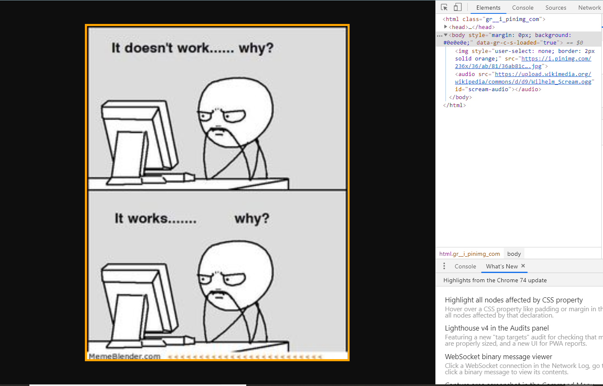
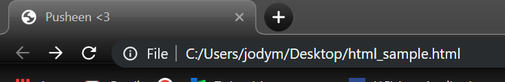
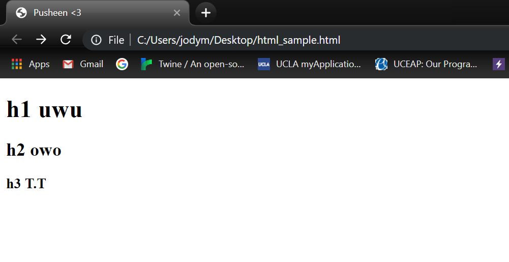
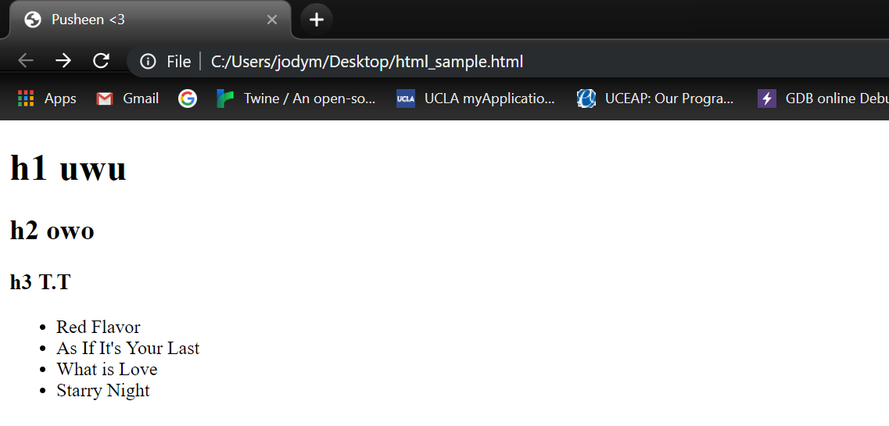
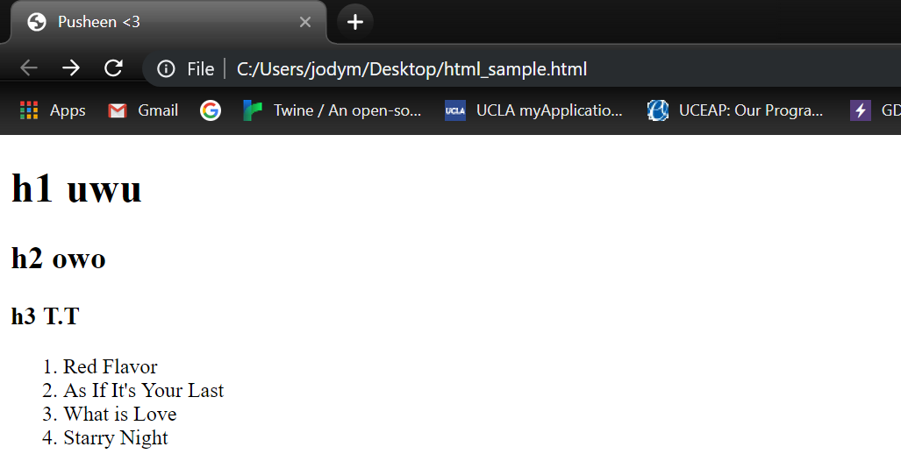
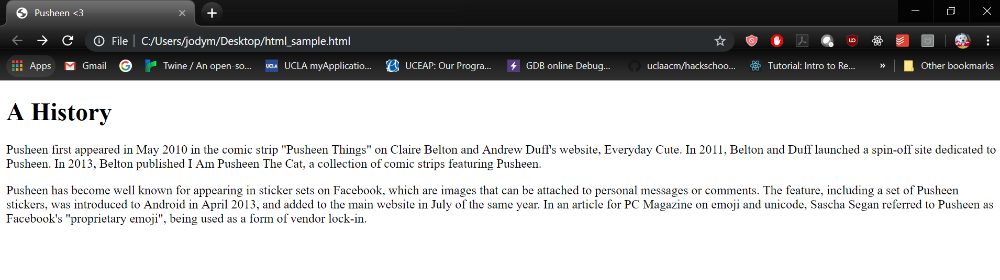
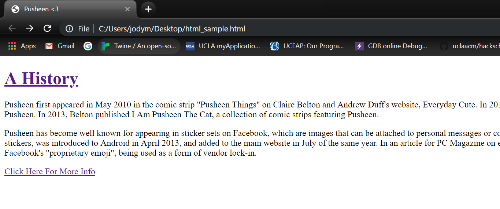

# Learn.py Session 6 Application of Python: Web Development Part 1

**Location:** Covel 227

**Time:** 6:15 PM - 8:15 PM, 15 May 2019

**Teacher:** Connie Chen

## Resources
**Slides**

**ACM Membership Attendance Portal**

**Additional Learning Materials**

* For more on web dev, check out our fall workshop series, Hackschool!
    * https://github.com/uclaacm/hackschool-f18
* Want to learn more about Django?
    * Documentation: https://docs.djangoproject.com/en/2.2/

## What we'll be learning today
* How does the ~web work?
* What is HTML/CSS?
* Intro to Django - a Python web framework!

The demo today will have quite a few files and directories - if you fall behind at any moment, check out the completed demo code in the repo, or ask a mentor for help!

## What you'll need:
* A text editor (like Sublime or VS Code or Vim)
* Python
* Django

### Installing Django on Windows:
* Open Powershell/Command Prompt
* `pip install django`

### Installing Django on Mac:
* Open Terminal
* `pip3 install django`

### Did it work?
* `python -m django --version`

This should output the version of Django you have installed.

Now let's get started!


## How does the ~web work?

You are the client. You request a webpage from a server, which is essentially a computer that's always running somewhere far far away. It responds by sending you the webpage you requested (assuming nothing goes wrong). Voila! You can now see a webpage on your browser. Welcome to the ~web!

## What is HTML/CSS?

HTML, or Hyper Text Markup Language, is a markup language used when creating webpages. It allows our webpages to have writing, links, pictures, videos, and much more. If you right click any webpage in Chrome and click 'Inspect Element', you'll see the HTML!



> The panel on the right shows the HTML that renders the meme in our browser. It's alright if you don't understand everything just yet; that's why you're reading this!

CSS stands for Cascading Style Sheets. It allows us to style our webpages, such as changing font size/color or changing the layout of our page.

Think of it this way, HTML is the skeleton code that puts content on a page while CSS is the code that styles our HTML and makes it look fancy :)

**Creating our first HTML file**

Let's create an HTML file called `index.html`

```HTML
<!DOCTYPE html>
<html>
    <head>
        <title>Cool Things</title>
    </head>
    <body>
        <h1>What cool things you can do with the web...?</h1>
        <ul>
            <li>You can create lists :o</li>
            <li>~Dark Mode</li>
        </ul>
        <p>And HTML and CSS can do way more than that! Colors, images,
            <a href="https://coolcssanimation.com">animations</a>, and <a href="https://fonts.google.com">fonts</a> are only the tip of the iceberg!
        </p>
        
    </body>
</html>
```
As you can see from the code above, we include many tags in our HTML file. Tags begin with a less than sign ('<') and end with a greater than sign ('>'). Whatever text is wrapped in a tag will be formatted with the tag's properties. We will define each of the tags we've used so far.

* ```<!DOCTYPE html>``` tag tells the browser that this will be an HTML file. We include this at the top of all of our HTML files.
* ```<html>``` and ```</html>``` tags are placed around our HTML content. This will enclose everything we code for our page.
* ```<head>``` and ```</head>``` tags contain information that is not typically displayed in the browser. In this tag we will typically set the `title` of our page, link our CSS code (the code that will style our HTML to make it look fancier), and import other necessary files (i.e. Google Fonts).
* ```<title>``` and ```</title>``` tags include the title of our page, which will be displayed on the webpage toolbar and on search-engine results.
    For example, the code below
    ```HTML
  <!DOCTYPE html>
  <html>
  	<head>
  		<title>Pusheen <3 </title>
  	</head>
  	<body></body>
  </html>
    ```
    will show up like this on our browser:
    

* ```<body>``` and ```</body>``` tags contain all visible content we will display on our page :)
* ```<h1>``` and ```</h1>``` tags contain a heading title
    * Header tags can range from 1-6, where 1 represents the largest and most important title and 6 represents the smallest title. Header tags are great to use when specifying section names.
    We can see what this looks like if we add some header tags in between our body tags from the previous example.
    ```html
  <!DOCTYPE html>
  <html>
  	<head>
  		<title>Pusheen <3</title>
  	</head>
  	<body>
  		<h1>h1 uwu</h1>
  		<h2>h2 owo</h2>
  		<h3>h3 T.T</h3>
  	</body>
  </html>
    ```
    This will show up as:
    

* ```<ul>``` and ```</ul>``` tags represent an unordered list. This allows us to create a bullet-point list.
* ```<li>``` and ```</li>``` tags contain the information we want in an element of our list.
  Let's see what this looks like. This code:
  ```HTML
  <!DOCTYPE html>
  <html>
  	<head>
  		<title>Pusheen <3</title>
  	</head>
  	<body>
  		<h1>h1 uwu</h1>
  		<h2>h2 owo</h2>
  		<h3>h3 T.T</h3>
  		<ul>
  			<li>Red Flavor</li>
  			<li>As If It's Your Last</li>
  			<li>What is Love</li>
  			<li>Starry Night</li>
  		</ul>
  	</body>
  </html>
  ```
  will look like this:
  

  Similarly, we could turn our bullet-point list into a numbered list by changing our `<ul></ul>` tags to the _ordered_ list tags `<ol></ol>`. So changing our above code will to this:
  ```HTML
  <ol>
    <li>Red Flavor</li>
    <li>As If It's Your Last</li>
    <li>What is Love</li>
    <li>Starry Night</li>
  </ol>
  ```
  will show up like this in our browser:
  

* ```<p>``` and ```</p>``` tags represent a paragraph. Whatever words we put in between these tags will be formatted as a paragraph.
  Let's make some changes to our previous example to show this:
  ```HTML
  <!DOCTYPE html>
  <html>
  	<head>
  		<title>Pusheen <3</title>
  	</head>
  	<body>
  		<h1>A History</h1>
  		<p>Pusheen first appeared in May 2010 in the comic strip "Pusheen Things" on Claire Belton and Andrew Duff's website, Everyday Cute. In 2011, Belton and Duff launched a spin-off site dedicated to Pusheen. In 2013, Belton published I Am Pusheen The Cat, a collection of comic strips featuring Pusheen.</p>
  		<p>Pusheen has become well known for appearing in sticker sets on Facebook, which are images that can be attached to personal messages or comments. The feature, including a set of Pusheen stickers, was introduced to Android in April 2013, and added to the main website in July of the same year. In an article for PC Magazine on emoji and unicode, Sascha Segan referred to Pusheen as Facebook's "proprietary emoji", being used as a form of vendor lock-in.</p>
  	</body>
  </html>
  ```
  This will now create two different paragraphs with our text.
  

* ```<a href="insert_some_link_here">``` and ```</a>``` tags contain the word or phrase that will lead to another link if clicked on. This tag can also wrap around other tags like paragraphs, headers, and even images.
    * href is an attribute that will specify the URL. This will go inside the starting/first link tag.
    Here we can see this in action:
  ```HTML
  <!DOCTYPE html>
  <html>
  	<head>
  		<title>Pusheen <3</title>
  	</head>
  	<body>
  		<a href="https://en.wikipedia.org/wiki/Pusheen"><h1>A History</h1></a>
  		<p>Pusheen first appeared in May 2010 in the comic strip "Pusheen Things" on Claire Belton and Andrew Duff's website, Everyday Cute. In 2011, Belton and Duff launched a spin-off site dedicated to Pusheen. In 2013, Belton published I Am Pusheen The Cat, a collection of comic strips featuring Pusheen.</p>
  		<p>Pusheen has become well known for appearing in sticker sets on Facebook, which are images that can be attached to personal messages or comments. The feature, including a set of Pusheen stickers, was introduced to Android in April 2013, and added to the main website in July of the same year. In an article for PC Magazine on emoji and unicode, Sascha Segan referred to Pusheen as Facebook's "proprietary emoji", being used as a form of vendor lock-in.</p>
  		<a href="https://pusheen.com">Click Here For More Info</a>
  	</body>
  </html>
    ```
    This shows up like this:
    

* `````` tag allows us to insert an image.
    * src is an attribute that specifies the URL to the image, which can be local or online. To obtain the link of an image in Google, right click it and hit 'Copy image address'.
  Let's put an image in our Pusheen html page!
  ```HTML
  <!DOCTYPE html>
  <html>
  	<head>
  		<title>Pusheen <3</title>
  	</head>
  	<body>
  		<a href="https://en.wikipedia.org/wiki/Pusheen"><h1>A History</h1></a>
  		<p>Pusheen first appeared in May 2010 in the comic strip "Pusheen Things" on Claire Belton and Andrew Duff's website, Everyday Cute. In 2011, Belton and Duff launched a spin-off site dedicated to Pusheen. In 2013, Belton published I Am Pusheen The Cat, a collection of comic strips featuring Pusheen.</p>
  		<p>Pusheen has become well known for appearing in sticker sets on Facebook, which are images that can be attached to personal messages or comments. The feature, including a set of Pusheen stickers, was introduced to Android in April 2013, and added to the main website in July of the same year. In an article for PC Magazine on emoji and unicode, Sascha Segan referred to Pusheen as Facebook's "proprietary emoji", being used as a form of vendor lock-in.</p>
  		<a href="https://pusheen.com">Click Here For More Info</a>
  		
  	</body>
  </html>
  ```
This will then add our Pusheen image!


So if we look at what our `index.html` file from before, we should be able to see this:

But, it doesn't look that great. This is where CSS comes in!

**Creating our first CSS file**

In the same directory that `index.html` is located, let's create `style.css`

```css
body {
    text-align: center;
    font-family: 'Noto Sans', sans-serif;
}

ul {
    display: inline-block;
    text-align: center;
}

h1 {
    font-size: 200%;
    font-weight: bold;
}
```
* Our first block of code begins with the selector body, which means everything inside the braces will apply to what we put between the body tags in our HTML file
    * text-align will help align our text. Here, we tell it to center our fonts, but other valid types of alignment we can use include right and left
    * font-family defines the type of font. It takes in multiple fonts because not all user will have a specific font. In this example, the browser will try to load Noto Sans, but if the user doesn't have this font, it will load sans-serif instead.    
* Our second block of code begins with the selector ul, which means means everything inside the braces will apply to our unordered list
    * The display of inline-block places the element on the same line as the adjacent content, but the element behaves as a block element.
* Our third block of code begins with the selector h1, which means everything inside the braces will apply to our header
    * The font-size determines the font size, so here, we decided to make the font 2 times bigger than the default size.
    * The font-weight allow us to create lighter or bolder forms of the content.


Great, now we have the CSS file! But what's the point if our HTML file doesn't use it?

To link the HTML and CSS file, add this inside the `head` tag in `index.html`

```HTML
<link href="https://fonts.googleapis.com/css?family=Noto+Sans" rel="stylesheet">
<link rel="stylesheet" href="style.css"/>
```

The first `<link>` tag import the Noto Sans font from the Google Fonts website, so that our CSS can apply it! (If you go to fonts.google.com, you can check out all their cool fonts, plus they make it super easy for you to import them into your own webpages). The second `<link>` tag imports our CSS file!

Try opening `index.html` now!

## Intro to Django

Now we have a beautiful HTML file. But, we can only serve one at a time. How can we serve multiple files at the same time? This is what we'll be playing around with in Django today.

But first, what is Django? Django is a Python web framework that can help us create complex web applications. A benefit of Django is that it contains everything we need to create a web application, including a command line interface, web server, database, built-in admin site, etc. This means that we don't have to install anything else besides Django to get a working web app (How cool is that??). Some popular websites that use Django are Instagram, Pinterest, and The Washington Post.  

Let try using Django!

**Setting up our project**

Django makes it really easy to get a web application up and running. Make sure you're in the directory you want to create your project in (preferably in the same directory as `index.html` and `style.css`), then type:

```
django-admin startproject mysite
```

This creates a new Django project called mysite. To start the server and get the web app running, `cd` into the `mysite` directory that was just created and type:
```
python manage.py runserver
```
This command starts a server at URL `localhost:8000`.
Try visiting `localhost:8000` in your browser.
You should see a default page given by Django.

Now we can start by linking the HTML file we just created.

Recall that web pages are served by the client sending a request to the server, and the server sends a response back (with the webpage we requested, hopefully). But we currently don't have any way to handle that exchange, so let's write a function to do that!

Create a file called `views.py` in the `mysite` directory

```python
from django.shortcuts import render

def home_page(request):
    return render(request, 'index.html')
```
This is a function that takes in the request from the user and
uses the `render` function to return a html page named `index.html`.

Wait, but our project currently doesn't know where to find `index.html`! It's not even in our project directory!

We could just move it into the top-level `mysite` directory, but we will most likely end up having many many HTML files in our project. So let's create a separate directory for our HTML files, called `templates`.

This is what your file directory should look like:


Move `index.html` inside `templates`.

Now we have our HTML files organized nicely in our project hierarchy, but Django doesn't know to look there for our files! To fix that, go to `settings.py` in the lower-level `mysite` directory, find the `TEMPLATES` variable, and modify it so it looks like this:

```python
TEMPLATES = [
    {
        'BACKEND': 'django.template.backends.django.DjangoTemplates',
        'DIRS': [os.path.join(BASE_DIR,'templates')],
        'APP_DIRS': True,
        'OPTIONS': {
            'context_processors': [
                'django.template.context_processors.debug',
                'django.template.context_processors.request',
                'django.contrib.auth.context_processors.auth',
                'django.contrib.messages.context_processors.messages',
            ],
        },
    },
]
```

We added the variable `os.path.join(BASE_DIR, 'templates')` to the array in the key `DIRS`.
`BASE_DIR` is a string that is the path to our `mysite` folder.
It will look something like `/folder/Desktop/mysite`.
`os.path.join` is a function that takes in 2 strings and joins them
to give a valid directory path. In this case, the output will be
`/folder/Desktop/mysite/templates`. Now Django knows where to look for
our HTML files.


Now that we're ready for the server's response, how do we send the request? Through URLS!

Find the file `urls.py` in the `mysite` directory, and modify it so it looks like this:

```python
from django.contrib import admin
from django.urls import path

from . import views

urlpatterns = [
    path('admin/', admin.site.urls),
    path('', views.home_page),
]
```

When a request comes in, Django tries to match the URL with the
patterns within `urlpattern`. If the user accesses `localhost:8000`,
it will match the pattern `''` and the function `home_page` will be
called. If user access `localhost:8000/admin/`, it will match the
pattern `admin/` and the function `admin.site.urls` will be called.

You might've noticed that all the hard work we put into styling `index.html` has disappeared. Like before, Django doesn't know about our CSS file!

Create a directory called `static`, in the same directory as our `templates` directory, and in there, create a directory called `css`. Move `style.css` into this directory.

> That seems like a lot of directories for just one file. And you're right, but, static files encompass more than just CSS files - image files are another example. While it may seem like overkill for this demo, it's a good idea to practice organizing your files this way.

To make sure Django knows to look there for all static files in the future, go to `settings.py`, and add this to the bottom of the file:

```python
STATICFILES_DIRS = (
    os.path.join(BASE_DIR, 'static'),
)
```

`STATICFILES_DIRS` is a tuple with one element. Just like above
we are passing a string to a directory `/folder/Desktop/mysite/static`.
Now Django also knows where to find the css files.

Now that you've changed the location of the CSS file, make sure that the HTML files that use it know where it is too! Go back to `index.html` and change the `<link>` tag to this:

```CSS
<link rel="stylesheet" href="static/css/style.css"/>
```

**Serving multiple webpages**

There are many reasons why someone would want to use Django, but one of them is so that we can serve multiple webpages. Let's do that now.

Create two new HTML files in `templates/`, like so:

```HTML
<!-- Call this darkMode.html -->
<!DOCTYPE html>
<html>
    <head>
        <link href="https://fonts.googleapis.com/css?family=Noto+Sans" rel="stylesheet">
        <title>Dark mode</title>
    </head>
    <body>
        <h1>Come to the dark side...</h1>
    </body>
</html>
```

```HTML
<!-- Call this piktures.html -->
<!DOCTYPE html>
<html>
    <head>
        <link href="https://fonts.googleapis.com/css?family=Noto+Sans" rel="stylesheet">
    </head>
    <body>
        <h1>Surfing Pikachu</h1>
        <p>I wish I knew how to surf, although not with Pikachu</p>
        
    </body>
</html>
```
Feel free to go back and look at the definition of each tag.
* ```<link>``` tag specified the relationship between our file and an external source
    * rel is an attribute that defines the type of relationship

Let's put our CSS knowledge to good use, and style these pages. We want to create separate CSS files for each, so create them in the `static/css/` directory:

```CSS
/* Call this darkMode.css */
body {
    text-align: center;
    font-family: 'Noto Sans', sans-serif;
    background-color: #303030;
    color: white;
}
```

```CSS
/* Call this piktures.css */
body {
    text-align: center;
    font-family: 'Noto Sans', sans-serif;
}

ul {
    display: inline-block;
    text-align: center;
}

h1 {
    font-size: 200%;
    font-weight: bold;
}
```

Feel free to go back and review the CSS terminology.

Now, let's link our HTML and CSS files.
In `darkMode.html`, add this line inside the `<head>` tag:

```HTML
<link rel="stylesheet" href="/static/css/darkMode.css"/>
```

Can you guess what you have to do to link `piktures.css` to `piktures.html`?

We have two more HTML files, yay! Now, we want to be able to access them via URL.

In `views.py`, add this function:

```python
def dark_mode(request):
    return render(request, 'darkMode.html')
```

Again, this serves the html file `darkMode.html` when the function
`dark_mode` is called.
But Django does not know when to call this function, so we need to add
a new URL pattern.


In `urls.py`, add this to the `urlpatterns` list:

```python
path('darkMode/', views.dark_mode),
```

Great! Now, when Django sees `localhost:8000/darkMode/` it knows to call the `dark_mode` function inside views.

Really quick, let's also create a link to that page in `index.html`

Edit the unordered list so that it looks like this:

```HTML
<li>You can create lists :o</li>
<li><a href="/darkMode">~Dark Mode</a></li>
```

Awesome!

Now, imagine we have 10 pages. They are all pictures of pikachu.
We want to serve them at the URL `piktures/1`, `picktures/2`, etc.
From what we have learned so far, we will have to define 10 functions
and 10 URL functions. 10 is still doable but imagine having 100, or
even 1000 pages.

Django allows you to create generic URL pattern that can capture
a lot of cases. In our case, we want to match URL with `piktures/`
followed by some integer. And then handle all the cases under the
same function.

In `urls.py`, add this to the `urlpatterns` list:

```python
path('piktures/<int:num>/', views.piktures),
```
This is a pattern where the URL has to be `piktures/` followed by some
integer, indicated by `int` keyword. o
We will see the meaning of `num` in just a second.

But `views.piktures` isn't defined yet! Let's do that:

```python
# In views.py
def piktures(request, num):
    print('num is equal to',num)
    return render(request, 'piktures.html')
```

This function will be called for a URL like `piktures/1`. But notice
the extra parameter `num`. Django will call this function with the
value of the integer mtched within the URL. For instance, if the
URL is `piktures/1`, `num=1`. If `piktures/2`, `num=2`.

We print out the number in the function just to be sure.

Now, you should be able to access the page `piktures.html` from any
URL like `piktures/1` or `piktures/2`.
Also check your terminal for output from the server, what numbers is
the server printing?

Given the flexibility, we can be very flexible with routing.
We can use something like `render(request, 'file' + str(num) + '.html')` to render multiple pages from one view function. Try creating some additional HTML files and using that function ;)

Note that you can't have slashes in file names, so you can't just create a file called `piktures/1.html`, so what you have to do in this case is create a new folder in `templates` called `piktures`, then add files called `1.html`, etc. in there!

We've only uncovered the tip of the iceberg as to what Django can do in this workshop. Feel free to learn more by checking out the documentation (there's a great tutorial in there), or trying out other online tutorials!

## Challenges:

Try creating a new HTML file! Introduce the person next to you, or if you're not at our workshop, introduce your favorite musician. Include some images, and style it nicely with your new CSS skillz.

After you've done that, see if you can set up the URL for it in our Django project!
