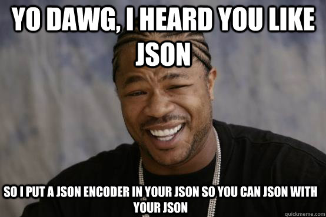

# Learn.py Session 7 Application of Python: Web Development Part 2

__Location__: Covel 227

__Time__: 6:15 PM - 8:15 PM, 33 May 2019

__Teacher__: Galen Wong

## Resrouces:
Slides: [TODO]()

[ACM Membership Attendance Portal](https://members.uclaacm.com/login)

- Want to dive deep into Web Dev? Check out our Hackschool workshop series!
  - https://github.com/uclaacm/hackschool-f18
- Django Documentation
  -  https://docs.djangoproject.com/en/2.2/

## What we'll be learning today?
- What is RPC
- What is JavaScript?
- What is JSON?
- What is an API?

## Recap
Last time we built a Django server application that serves
different html pages based on the routes. 
Let's revisit it. 
First, we create a new Django application.

```
django-admin startproject myapp
```
And your `myapp/` directory should have the same 
structure as this...


... I mean this
```
├── manage.py
└── myapp
    ├── __init__.py
    ├── settings.py
    ├── urls.py
    └── wsgi.py
```

Create a file named `views.py` under `myapp/myapp/`.
```
├── manage.py
└── myapp
    ├── __init__.py
    ├── settings.py
    ├── urls.py
    ├── views.py (We added this file)
    └── wsgi.py
```

Inside `views.py`, we import a function from Django
named `HttpResponse`, create a string that holds our
html page.
```py
from django.http import HttpResponse

my_html = '''
<!DOCTYPE html>
<html>
    <body>
        <h1> Hello World </h1>
    </body>
</html>
'''
```

Then, we can write a function that returns this simple 
page with `HttpResponse`.
```py
def hello_world(request):
    return HttpResponse(my_html)
```

Finally, we add a route to this function in `urls.py`.
```py
from . import views # remember to import

urlpatterns = [
    path('', views.hello_world),
    path('admin/', admin.site.urls),
]
```

We can start the server with
```
python manage.py runserver
```
If you access `localhost:8000` in your browser, you 
should see the simple HTML page we defined.

You might have noticed that we used a different function
to return a html page this time. Last time, we used 
`render` but we are using `HttpResponse` this time. 
But they do the same thing, except we put the html text 
in a file and pass the file name to `render`, and 
`HttpResponse` simply takes in a string.


### Django Routing Model 


Django calls the corresponding function based on the 
request URL. It matches the URL one by one with the 
URL pattern defined by us in the list `urlpatterns`.
This is how the routing is done.

When a request comes in with URL `localhost:8000`,
Django extracts whatever is after the domain name,
aka this `localhost:8000` portion. Well, it is an 
empty string. Then, Django compare the suffix 
portion (the empty string here) with each path
in the `urlpattern` list. It matches the first one,
then it calls the corresponding function `hello_world`.

## What is RPC?
RPC stands for Remote Procedure Call. 
- Remote
  - Remote means the operation is on a server
- Procedure
  - This word is just a fancy term for function 

Putting it together, RPC is the action of calling a 
function in the server instead of in your code.

## Examples of RPC 
Well, we just did one! The action of visiting our
"hello world" web page was a RPC. We have use an URL 
`localhost:8000` to access the server with a request and 
the server calls a function `hello_world` for us using 
the routing mechanism. The function returns a string 
which is in the response and the string is displayed on
the browser. If the string is an html page, the browser
renders it with style.

Now we see the server as a blackbox that provides us 
with different functions for us to call.

Let's us build some function that we can call.

```py
# views.py
def squared(request, num):
    sq = num * num
    return HttpResponse(sq)
```
Also add a route to this function
```py
urlpatterns = [
    path('', views.hello_world),
    path('square/<int:num>/', views.squared),
    path('admin/', admin.site.urls),
]
```
Remember from last time. We can match generic number with
the `<int:num>` special string within our URL pattern.
And Django will call our `squared` function with 
parameter `num` set to the value in the URL.

See what happens when you access the "page" 
`localhost:8000/square/2` from your browser.

This is just like calling a function. __We call a 
function on the server with the URL which helps the 
server (Django) to identify which function you want to 
call!__ This is also a RPC.


Now we see that using URL, not only can we request for 
html page, we can also request for data. 
So far we only have 2 types of data. We requested for 
(1) an HTML page, (2) a number/integer. 

## What is JavaScript?
```js
Array(16).join('wat' - 1) + ' Batman!';
```


Well, so far our webpages have been static. We can also 
make it more interactive with JavaScript. 
JavaScript is a programming language for the web. __It 
allows you to interact with a HTML page and modify it.__

Let's try it out! First, we create a `index.html` file.
```html
<!DOCTYPE html>
<html>
<head>
	<title></title>
</head>
<body>
	<button id="btn">Calculate 2 squared</button>
	<h1>Answer:</h1>
	<h1 id="answer"></h1>
</body>
```
Notice how we have a `id` attribute to the tags `button` 
and `h1`. This attribute allows us to name an element so 
we can tell it apart from the other tags. For example,
`h1 id="answer"` is different from just `h1`. 
We will use it in JavaScript later.

Where do we add our JavaScript then? We can add it inside
a special tag called `script`.

```html
<!DOCTYPE html>
<html>
<head>
	<title></title>
	<script type="text/javascript">
		console.log('welcome to JavaScript');
	</script>
</head>
<body>
	<button id="btn">Calculate 2 squared</button>
	<h1>Answer:</h1>
	<h1 id="answer"></h1>
</body>
</html>
```
`console.log` is the `print` function in JavaScript. 
To see that it got executed, we can go to the Console 
in our browser.
1. Left click on any page. Click `Inspect`.
1. You should see something like this.


If you go to the `Console` Tab, you should see
`welcome to JavaScript` being outputed.

How can we access the HTML element/tags?
We use a built in function called `getElementById`.

```js
// within the <script> tag
function main() {
    var ourButton = document.getElementById('btn');
    var ourAnswer = document.getElementById('answer');
    console.log(ourButton.innerText);
}
window.onload = main;
```
Notice a few things here. 
- `var ourButton` is how we declare a variable in JavaScript
- `getElementById` returns an HTML object
- `ourButton` and `ourAnswer` are objects that refers to our 
  `button` tag and `h2` tags
- `function name() {}` is how we define a function in JavaScript
- we can assign a function to a variable called `window.onload`
    - this tells JavaScript to execute this function when the 
      page finishes loading

We do not have time to cover a lot of JavaScript in this workshop. 
If you are interested, please checkout HackSchool's tutorial on 
JavaScript. 

Reload your `index.html` in your browser to see what happens in 
the Console!

Quite cool! We can see what is inside the `button` tag 
by printing a property within the object of `ourButton`.
Let's serve this page as part of our Django server!

We put this file inside a folder called `templates`.
```
├── db.sqlite3
├── manage.py
├── myapp
│   ├── __init__.py
│   ├── settings.py
│   ├── urls.py
│   ├── views.py
│   └── wsgi.py
└── templates (we added this)
    └── index.html
```
We add a function for this page in `views.py`
```py
def squaredPage(request):
    with open('templates/index.html', 'r') as f:
        return HttpResponse(f.read())
```
Remember file handling? We directly here read the html file.
And returning its contents as string!
Now we add a route to this function in `urls.py`
```py
urlpatterns = [
    path('', views.hello_world),
    path('square/<int:num>/', views.squared),
    path('square/', views.squaredPage), # we added this line
    path('admin/', admin.site.urls),
]
```

Try visting `localhost:8000/square` in your browser.
See what happens!


## Request for data in the webpage 
Remember the very complicated function that we defined in 
our server? We can make use of it from our website!
Also, by making a request to the server at the given URL. 
We have been making request by typing the URL in our browser.
JavaScript provides a function `fetch` for us to let our 
code make a request to server as well!

```js
function main() {
    var ourButton = document.getElementById('btn');
    var ourAnswer = document.getElementById('answer');
    fetch('http://localhost:8000/square/2')
    .then(function (response) {
        console.log(response);
    });
}
window.onload = main;
```

It prints a sort of convoluted object inside the console.
We should be simply expecting the number `4` in the 
response. It does not seem to be anywhere. 
Turns out we need to get it in another `then` block.
```js
fetch('http://localhost:8000/square/2')
.then(function (response) {
    return response.json();
})
.then(function (answer) {
    console.log(answer);
});
```

Now we see `4` being printed in our Console!
Again, this is RPC. We use the URL to call a function
sitting in our server.

## Time to Get Interactive
Let's say we want to trigger the RPC only when user
click the button. 
```js
ourButton.onclick = function () {
    fetch('http://localhost:8000/square/2')
    .then(function (response) {
        return response.json();
    })
    .then(function (answer) {
        console.log(answer);
    });
}
```
By setting `ourButton`'s `onlick` property to a function,
JavaScript will call our function which does the RPC 
for us. Now when you reload the page. It should not 
print anything, unless you click the button.

Printing the result to the Console is not that helpful.
We can put it onto our screen. By setting `ourAnswer`'s
`innerText` property!
```js
ourButton.onclick = function () {
    fetch('http://localhost:8000/square/2')
    .then(function (response) {
        return response.json();
    })
    .then(function (answer) {
        console.log(answer);
        ourAnswer.innerText = answer;
    });
}
```

Now, try reloading the page and click the button.
The number `4` should pop up on your screen.

## What's the point of this?


You must think I am quite stupid. If I want to use a 
function that compute a number squared in my website,
I can simply do that with JavaScript.
```js
function square(x) {
    return x * x;
}
```
Why bother to write a server for this simple function?
Well, when your function grows more complicated, we 
need the server to help us. Let's see an example.

Head over to https://m.uber.com/looking.
When you select a destination, it gives you the price 
for different types of vehicles.


Imagine the function that Uber uses to calculate the 
price. Its complexity is way beyond our `square` 
function. We need to have an optimal path algorithm to
obtain the route. We need to know the congestion level
and availability of drivers. Considering all these 
factors, it is impossible to write a function in our 
webpage for this. 

More importantly, this website requires user input. 
User needs to select a destination before it can 
calculate the price, right?

This does not really justify me, the stupid, putting a 
square function inside a function. It is just an 
overkill. However, 

<h2>
I hope you see the point of RPC.
I hope you know how to set up RPC on server.
I hope you know how to do a RPC in JavaScript 
(aka from the website).
</h2>

## What is JSON?

So far, our remote function only returns a number. 
What if we want it to return a way more delicated data
structure, for example, a list, a dictionary?

Before that, let's look at one data type in JavaScript,
__Object__.

```js
var myObject = { 'name': 'Galen', 'age': 12 };
```
Wait a minute, this looks quite familiar. Isn't this
just like a dictionary in Python?
```py
myDict = { 'name': 'Galen', 'age': 12 };
```
Yes, it is exactly that.
Whatever you can do to a dictionary in Python you can do 
to an object in JavaScript.

<div style="display: flex; width: 100%">

```py
# Python
myDict = { 'name': 'Galen', 'age': 12 }
myDict['gpa'] = 1.2
myDict['age'] = 13
myDict['arr'] = [1, 2, 3]
print(myDict)
# output: { 'name': 'Galen', 'age': 13, 'gpa': 1.2, 'arr': [1, 2, 3] }
```

<div style="width: 10px">
</div>

```js
// JavaScript
var myObj = { 'name': 'Galen', 'age': 12 };
myObj['gpa'] = 1.2;
myObj['age'] = 13;
myObj['arr'] = [1, 2, 3];
console.log(myObj);
// output: { 'name': 'Galen', 'age': 13, 'gpa': 1.2 , 'arr': [1, 2, 3]}
```
</div>

>Yes, list in Python looks like Array in JavaScript as well. 

Now, I can tell you what JSON stands for: __JavaScript Object Notation__.
They are data that looks like a JavaScript object.
To send complex data strucutre, we can send over with JSON!
Let's check out some examples.
Head over to official-joke-api.appspot.com/jokes/random.

```json
{
    "id": 74,
    "type": "programming",
    "setup": "Why do C# and Java developers keep breaking their keyboards?",
    "punchline": "Because they use a strongly typed language."
}
```
You see that it returns a python-dictionary-like data. Again, this is a RPC. 
You are calling some function in the server that returns you a JSON object
that contains some random jokes.

Let's try it out Django as well.

```py
# views.py
from django.http import HttpResponse, JsonResponse
# ...
def squared(request, num):
    sq = num * num
    myJson = {
        'answer': sq,
        'count': 0
    }
    return JsonResponse(myJson)
```

Now try `localhost:8000/square/2`. Again, does it return only a number this 
time?

We see that using Python objects, we can easily send JSON data.
Let's make the server remember the number of times that our squared function
is being called. And return it in the `'count'` field within our JSON.

```py
# views.py
from django.http import HttpResponse, JsonResponse
# ...
num_calls = 0
def squared(request, num):
    sq = num * num
    global num_calls # access global variable
    num_calls += 1
    json = {
        'answer': sq,
        'count': num_calls
    }
    return JsonResponse(json)
```
Note that to refer to a global variable, we have to use the `global` keyword.
Now, each time you access `localhost:8000/square/2` it should increment the 
counter and return it in the JSON response. Now let's see how the data is
represented in JavaScript in our webpage.

We temporarily comment out the line where we put data on the page. We want 
to see the data first.
```js
ourButton.onclick = function () {
    fetch('http://localhost:8000/square/2')
    .then(function (response) {
        return response.json();
    })
    .then(function (answer) {
        console.log(answer);
        // ourAnswer.innerText = answer;
    });
}
```

If you head to Console, you should see the output as an object! 
```js
{answer: 4, count: 1}
```
This is convenient since Python and JavaScript uses 2 simliar data types
that can be easily expressed as JSON. 

We can now put both of our data onto the page.
```js
ourButton.onclick = function () {
    fetch('http://localhost:8000/square/2')
    .then(function (response) {
        return response.json();
    })
    .then(function (answer) {
        console.log(answer);
        var text = answer['answer'].toString() + ' count: ' + answer['count'].toString();
        ourAnswer.innerText = text;
    });
}
```

Now our webpage also shows the count as well!


It looks ugly but you can CSS to style it.

## Server sends JSON, Client sends JSON too!
So far, we only see an example of server sending JSON data to client 
(aka our webpage). However, client can also send JSON data to server. 
Such operation is neccessary when you take in complex input from the user.
For instance, a location on a map. However, we do not have time to cover
those. But you have a solid understanding of things to try it on your own.
As a first step, read the `fetch` function documentation and see our examples
from HackSchool!



## Conclusion: What is an API?

Now, you understand why we need RPC. We need it for complex computation or 
operation. Also, if the data depends on the state of the server, for instance
the `num_calls` variable in our Django app, we will need to use RPC. RPC also
increase usability and interactions. You also know how to pass complex data
between the server and client.

Back to the Uber example. Now you know all the neccessary mechanism to 
implement such call (of course, when Uber provides you with a function to 
calculate ride fares). When you select a location, some `button.onclick` 
function is triggered and a RPC is done and some JSON data is sent back to
our web page. Then, the fares are displayed on the webpage. 

Previously, you might have heard the word "API" floating around. 
It stands for Application Programming Interface. In the context of web,
it usually refers to a set of routes/endpoints that we can use to retrieve
data via RPC. Our `/sqaure/2` route is an example of an API. 

In fact, Uber exposes some of their API for us to use as well. If you check
out the [Uber API docuemention](https://developer.uber.com/docs/riders/references/api/v1.2/estimates-price-get).
You can estimate the price for a ride, through a RPC with `fetch` function.
This means that you can build our own webpage that estimate Uber price for you!
