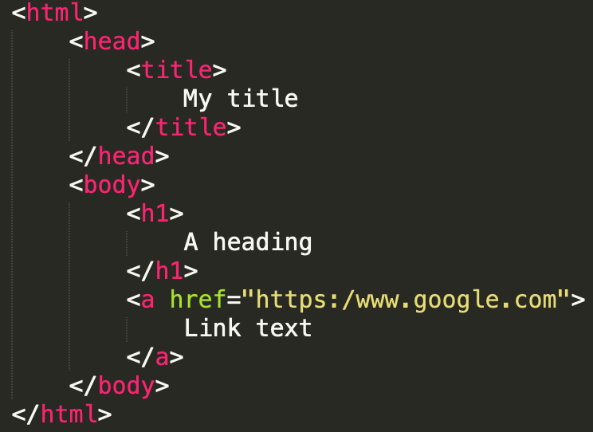
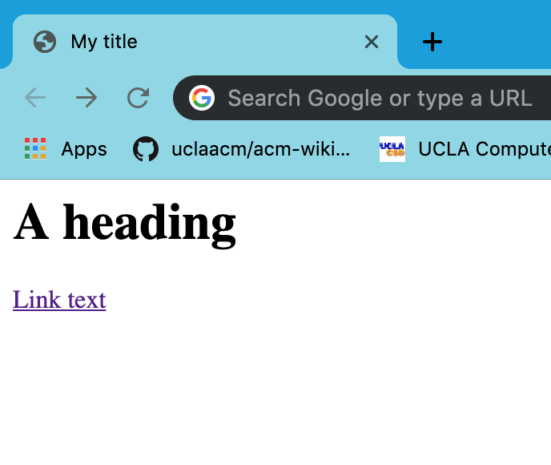
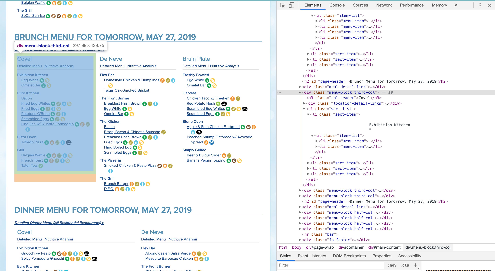
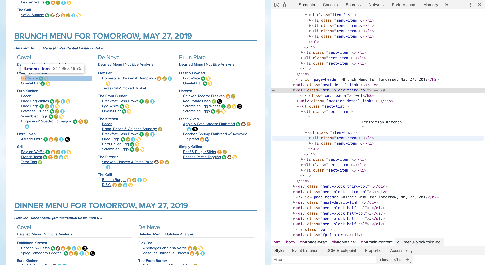
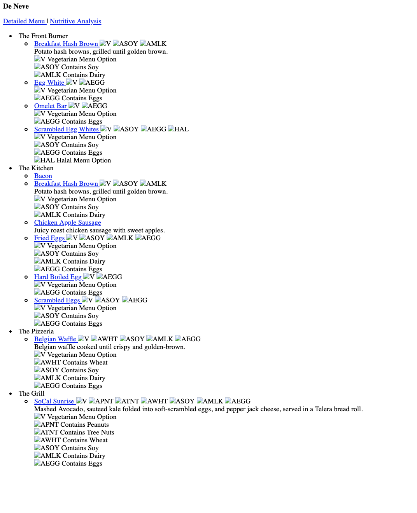
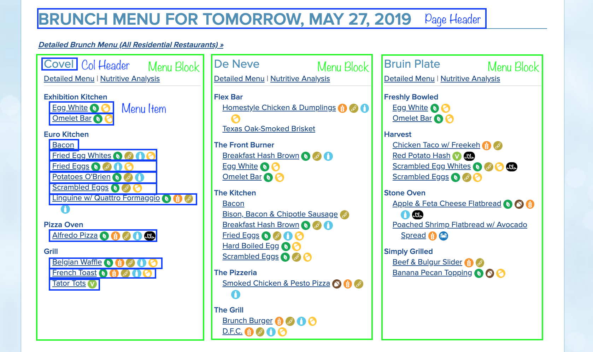
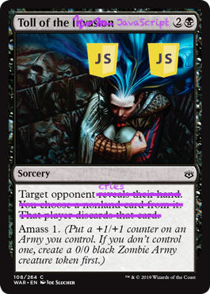
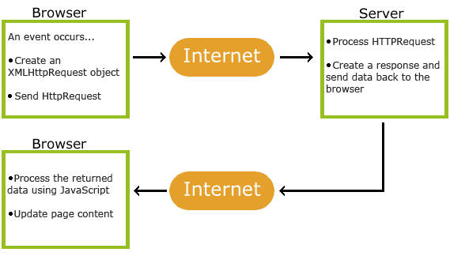
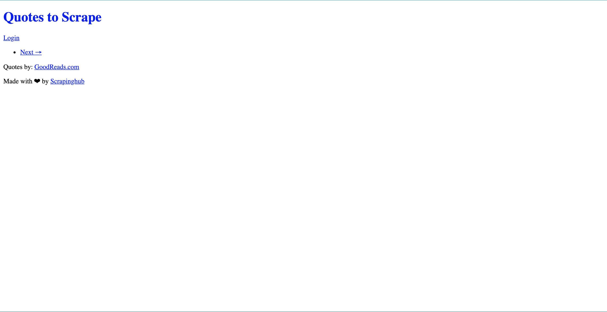
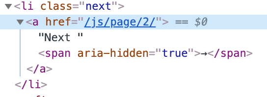

# Learn.py Session 8 Application of Python: Web Scraping

**Location:** Covel 227

**Time:** 6:15 PM - 8:15 PM, 29 May 2019

**Teacher:** Tim Rediehs

## Resources
**Slides**
* tinyurl.com/learnpy-s8

**ACM Membership Attendance Portal**
* [Portal](https://members.uclaacm.com)
* Code: #WebSnaking

**Additional Learning Materials**
* BeautifulSoup
    * [**Installing BeautifulSoup**](https://pypi.org/project/beautifulsoup4/)
    * [Documentation](https://www.crummy.com/software/BeautifulSoup/bs4/doc/)
* Selenium
    * [**Installing Selenium and Web Drivers**](https://pypi.org/project/selenium/)
    * [Documentation](https://seleniumhq.github.io/selenium/docs/api/py/py-modindex.html)
        * Look for selenium.webdriver.remote.webelement for some of the stuff we went over!
    * [Unofficial Documentation](https://selenium-python.readthedocs.io/)

## What we'll be learning
* Background about the web and html
* Web scraping: what and why
* How to use **BeautifulSoup** and **Selenium** for web scraping

## What you'll need:
* A text editor (like Sublime or VS Code or Vim)
* Python
* BeautifulSoup4
* Selenium
* A web driver for Selenium (I will use chromedriver)
    * **Note**: I will use ChromeDriver for Google Chrome.  I suggest you do too.
    * **Note**: Which ever web driver you use you will need the corresponding web browser.

### Installing on Windows:
* Open Powershell/Command Prompt
    * `pip install requests`
    * `pip install beautifulsoup4`
    * `pip install selenium`
* Follow this [link](https://pypi.org/project/selenium/)
    * Scroll down to the [drivers section](https://pypi.org/project/selenium/#drivers) and click the link for your browser.  I will plug Chrome again here.
    * Download the web driver version that corresponds to your web browser version.
    * You're done!  Just remember where the driver file is.  We'll need it later.
* Check it it worked with `pip list`!  You should see beautifulsoup and selenium listed.

### Installing on Mac/Linux:
* Open Terminal
    * `pip3 install requests`
    * `pip3 install beautifulsoup4`
    * `pip3 install selenium`
* Follow this [link](https://pypi.org/project/selenium/)
    * Scroll down to the [drivers section](https://pypi.org/project/selenium/#drivers) and click the link for your browser.  I will plug Chrome again here.
    * Download the web driver version that corresponds to your web browser version.
        * You can [check Chrome's version](assets/ChromeVersion.png) by clicking the **three dots** on the top right of the screen → **Help** → **About Google Chrome**
    * You're done!  Just remember where the driver file is.  We'll need it later.
* Check it it worked with `pip3 list`!  You should see beautifulsoup and selenium listed.

## Our Goal
**We want to be able to write a program that can automatically find useful information on webpages.**

## How might a human do this
When you look at the dining hall for food, you scan through the menu of each dining hall to find what you like.  You might read through Covel's menu and find something you like.  Once you find something, you know your looking in Covel under – let's say – dinner.  So you note that Covel is serving that food for dinner and continue looking.  

The program will do this too!  However, instead of the page your web browser presents, it just looks at the HTML. It will look at the menu for each dining hall and meal period, and it will scan for food that you tell it you like.  We can break it down into steps

1. Navigate to the page / Request the page
2. Find all of the menus
    1. Find all of the food in each menu
3. Output only the food we like (filter the list)

## We need to talk about trees
It's just like a family tree! Note that a descendant and ancestor also take their meanings from a family tree.  


## HTML – It's still here
As we talked about in our web dev session. HTML is a markup language used when creating webpages.  Since HTML is how webpages are generally represented, we need to have a basic knowledge of how it works. However, we don't care about what each tag does or how to write HTML anymore.  We care only about the **structure** of and HTML file and how to **search and navigate** though it.

An HTML file is structured as a tree.  This means that there is one big element, the `<html>` element, that contains many **children** elements within it.  Each element inside can also have more elements in it and so on.  



A lot of web pages will **reuse elements**.  We can use this to our advantage because the format of the file becomes repetitive and predictable. We will see an example of this when we start web scraping.

## Quick Challenges:
### Draw the DOM tree for the following HTML
*You may omit the text, only worry about HTML elements*
```html
<html>
    <head>
        <title>Snakes</title>
    </head>
    <body>
        <h1> Snakes </h1>
        <p> Snakes are really cool.  I made a list of all the reasons that snakes are the coolest animals.</p>
        <li>
            <ul>They look like noodles</ul>
            <ul>They can do like <em>999</em> damage</ul>
            <ul>They go ssssssssss</ul>
        </li>
        <p>Thank you for coming to my TED talk.</p>
    </body>
</html>
```

## What is web scraping
**Web scraping** is the (usually automated) process of extracting data from the web.  For example, if you manually used the internet to take note of a few stock prices then you are technically web scraping.  Our goal, however, is to automate this mundane task.  How do we do this?  Well, a lot of websites will repeat similar elements to display information.  These elements are usually formatted the same way, so we can search for these elements and find what we want easily.  **Patterns and repetition** are some of the most important things in web scraping.  How might a page be organized such that you know where to find information easily?

## Why use web scraping
The internet has a wealth of information!  Sifting through all it manually is a hassle.  If a website is nice, the owners will provide an API (Application Program Interface).  An API may let you get the data you want straight from the server.  For example, a API for a dictionary might let you send the server a word directly and then respond to you with the definition.  If this is the case, we're done.  We don't need to web scrape for that information because we can just ask the server directly.

Here's the catch.  Not all servers are so nice.  Some of them don't provide an API or even worse... they provide an API with a bunch of strings attached.  Without an API, how can we get any information?  This is when we use web scraping.  We can simulate a user going to a web page and finding the information we want.  It's like having a robot that googles stuff for you!

## Disclaimer: The efficacy of web scraping
Like anything, web scraping must be used responsibly.  Remember a few things:
1. Some information may be under Copyright.
2. You must be authorized to access said information (no hacking, kids)
3. Don't spam a server.  Sending to many requests to a server can overwhelm it which can cause harm to the people who rely on it – or maintain it!

## Let's Start Coding: BeautifulSoup
Our goal here is to get a webpage's HTML and get information from it, so lets do the first step!  Let's **request a webpage**.  We'll use the UCLA dining menu: http://menu.dining.ucla.edu/Menus. First, we need to import the two libraries
* `requests`: we'll use this to ask websites for their HTML page (this is a "request")
* `BeautifulSoup` (bs4): we'll use this to sort through the HTML page from the response from `requests`

```python
import requests # We are using requests.get from here
from bs4 import BeautifulSoup
```

Now, lets make a request to the UCLA dining page to get it's content.  We use `requests.get` which will give us a special `response` object that contains what the server sent us.  **`requests.get` is like typing a url into a web browser**.  However, where your browser would display the page all pretty for you, we just get the content of the response as a string.

```python
my_response = requests.get("http://menu.dining.ucla.edu/Menus")
```
Now that we have our response, let's print the page's content and see what's there. You can even get other stuff like the status code (which should be 200 for OK – the request succeeded).
```python
print(my_response.status_code)
print(my_response.content)
```

---
**Checkpoint: Your file should look like this:**
```python
from bs4 import BeautifulSoup
import requests # We are using requests.get from here
my_response = requests.get("http://menu.dining.ucla.edu/Menus")

print(my_response.status_code)
print(my_response.content)
```
---
If you run this, you'll notice that, although the output contains the HTML we want, it looks terrible.  We can use BeautifulSoup to make it look nicer. 
```python
soup = BeautifulSoup(my_response.content, 'html.parser')
print(soup.prettify())
```
---
**Checkpoint: Your file should look like this:**
```python
from bs4 import BeautifulSoup
import requests # We are using requests.get from here
my_response = requests.get("http://menu.dining.ucla.edu/Menus")

# print(my_response.status_code)
# print(my_response.content)

soup = BeautifulSoup(my_response.content, 'html.parser')
print(soup.prettify())
```
---

When you run this, you'll notice that the HTML is nicely formatted now, but this isn't the only thing BeautifulSoup can do.  It can also search the page for different elements.  

### Finding the Food and Printing It
Let's take a look at the UCLA dining page. Right click on one of the menu items and select inspect element.  The element that should be highlighted has an `<a>` with `class=recipelink`.  This is the element with the information we want.  Try right clicking on a different menu item and selecting inspect element again.  They should look very similar.  We can use this similarity. Now, scroll up and find and tag that looks like this: `<div class="menu-block third-col">`.  Note that `third-col` can be different depending on the time of day.  If you hover over it, Chrome will highlight where that element is on the page!



    Sidebar: 
    What is `<div>`: a div tag's longer name is a divider.  Think of it like a container that simply holds other elements.

    What is "class": class is a broad category for css for consistent styling of similar elements.

    Why we care about "class":  Since classes group similar items, we can find all items of one type (say, menu blocks) by searching for a class.  It's all about patterns!  Classes indicate where elements are repeated.


```html
<!--Each Element is inside of the one above it-->
<div class="menu-block third-col"> <!--BLOCK FOR EACH DINING HALL-->
|– <ul class="sect-list">
|  |– <li class="sect-item">
|  |  |- <ul class="item-list">
|  |  |  |- <li class="menu-item"> <!--FOOD ITEM WITH EXTRA INFO-->
|  |  |  |  |- <span class="tooltip-target-wrapper">
|  |  |  |  |  |- <a class="recipelink"> <!--FOOD ITEM TEXT-->
```

So we can see that each block for each dining hall is represented by a `<div>` element with the class `menu-block [X]`.  So, **each of these elements contains the food for a specific dining hall at a specific time.**  Let's grab all of them.  Since the class of the blocks we want all start with "menu-block" we can find all `<div>` elements where `class` starts with "menu-block".

```python
def is_menu_item(class_name):
	return str(class_name).startswith("menu-block")

# Find all <div> elements where is_menu_item returns true given its class
menu_blocks = soup.find_all("div", {"class":is_menu_item})
```
We do two things here:
1. Define a function that returns true if the string `class_name` starts with "menu-block"
2. find all `<div>` elements whose `class` start with "menu-block"

Great!  Let's check if it worked by printing the first block!
```python
print(menu_blocks[0].prettify())
```
If you copy this into a text editor like Sublime and wrap the whole thing in `<html> <body> [COPIED STUFF] </body> </html>` then open it with a web browser, you'll see that it indeed displays only one dining hall's information.  You will also notice that it looks very ugly.  Don't worry about that, it's just because we didn't copy the CSS.


---
**Checkpoint: Your code should look like this:**
```python
from bs4 import BeautifulSoup
import requests # We are using requests.get from here
my_response = requests.get("http://menu.dining.ucla.edu/Menus")

# print(my_response.status_code)
# print(my_response.content)

soup = BeautifulSoup(my_response.content, 'html.parser')
# print(soup.prettify())

def is_menu_item(class_name):
	return str(class_name).startswith("menu-block")

menu_blocks = soup.find_all("div", {"class":is_menu_item})
print(menu_blocks[0].prettify())
```
---

Upon running the program, your output should be a sizeable amount of HTML that starts with `<div class="menu-block whole-col">` at the top line.  Everything else is inside this div (notice the `</div>` closing tag at the very end)!  This is the first of the elements we were looking for.  Now, **we want to find and print the food items in this block**.  

If you look back at inspect element for a menu item, you can find the following information from this block:


You can see how this corresponds to the page we see.



Notice that the they put all of the menu options in elements with the tag `<li class="menu-item">`.  So, in our menu block, we can grab all of the `<li>` elements with the "menu-item" class. Let's start writing a function that takes a block and prints all the food, the dining hall for that block, and the time for that block.

```python
def print_food_from_block(block):
    # TODO
```
Let's get the **meal period** from the element.  The meal period is the first `<h2>` element above our menu-block, and it is also directly under `<div id="main-content" role="main">` like our menu-block is, so our menu-block and the `<h2>` element share a parent.  That makes them siblings.  No, I'm not kidding, that's what we call them.  

```python
def print_food_from_block(block):
    # gets the text (no <h2> tags) of the first <h2> element above block 
    time = block.find_previous_sibling("h2").text
```

Now, let's get the **dining hall**.  The dining hall is the first h3 element inside the menu-block, so we can cheat a little and use '.' to get that.  So, `block.h3` means "get the first `<h3>` element directly under `block`".

```python
def print_food_from_block(block):
    # gets the text (no <h2> tags) of the first <h2> element above block 
    time = block.find_previous_sibling("h2").text
    # gets the text of the first <h3> element directly under block
    dining_hall = block.h3.text
```
That's 2 out of 3!  Now lets... **find_all**... of the menu items, get the name of the food, and print our output!
```python
def print_food_from_block(block):
    # gets the text (no <h2> tags) of the first <h2> element above block 
    time = block.find_previous_sibling("h2").text.split()[0]
    # gets the text of the first <h3> element directly under block
    dining_hall = block.h3.text
    # find all <li> elements with class "menu-item"
    menu_items = block.find_all("li", {"class":"menu-item"})
    # for each menu item, add its text to the list
    # NOTE: the text we want is in an <a> element which is in a <span> element
    for item in menu_items:
        food = item.span.a.text
        print(f"{dining_hall} is serving {food} for {time}")
```
Now, lets call this function on all of the menu-blocks.
```python
for block in menu_blocks:
    print_food_from_block(block)
```

---
**Checkpoint: Your code should look like this:**
```python
from bs4 import BeautifulSoup
import requests # We are using requests.get from here
my_response = requests.get("http://menu.dining.ucla.edu/Menus")

# print(my_response.status_code)
# print(my_response.content)

soup = BeautifulSoup(my_response.content, 'html.parser')
# print(soup.prettify())

def is_menu_item(class_name):
	return str(class_name).startswith("menu-block")

menu_blocks = soup.find_all("div", {"class":is_menu_item})
# print(menu_blocks[0].prettify())

def print_food_from_block(block):
	# gets the text (no <h2> tags) of the first <h2> element above block 
	time = block.find_previous_sibling("h2").text.split()[0]
	# gets the text of the first <h3> element directly under block
	dining_hall = block.h3.text
	# find all <li> elements with class "menu-item"
	menu_items = block.find_all("li", {"class":"menu-item"})
	# for each menu item, add its text to the list
	# NOTE: the text we want is in an <a> element which is in a <span> element
	for item in menu_items:
		food = item.span.a.text
		print(f"{dining_hall} is serving {food} for {time}")

for block in menu_blocks:
    get_food_from_block(block)
```

### Using the Information
So we printed the dining menu.  That's a great start to web scraping, but we can do better.  Let's pick out foods we like from the dining halls.  This will involve doing three things
1. Create a class to store the menu times we get (a FoodItem class)
2. Modify `print_food_from_block(block)` to return a list of FoodItems.  We'll call it `get_food_from_block(block)`.
3. Write a function `find_foods(foods, liked_foods)` that returns a list of items in `food` that also contain one or more `liked_foods`

**Here is the FoodItem class**:
```python
class FoodItem:
	def __init__(self, name, hall, time):
		self.name = name
		self.hall = hall
		self.time = time.split()[0]

	def __repr__(self):
		return f"Name: {self.name}\nHall: {self.hall}\nTime: {self.time}\n"
```
`__repr__`: A special function that answers the question: "How should a FoodItem object look when printed?"  It's *super cool*.

`FoodItem` is just a container to store the food information we care about.  Nothing fancy!

**Next, let's write get_food_from_block**

We can actually copy print_food_from_block with a few modifications (four to be exact):

```python
# NEW 1: Remember to change the function name!
def get_food_from_block(block):
    # NEW 2: create a empty list of elements to return
    new_items = []
    # gets the text (no <h2> tags) of the first <h2> element above block 
    time = block.find_previous_sibling("h2").text.split()[0]
    # gets the text of the first <h3> element directly under block
    dining_hall = block.h3.text
    # find all <li> elements with class "menu-item"
    menu_items = block.find_all("li", {"class":"menu-item"})
    # for each menu item, add its text to the list
    # NOTE: the text we want is in an <a> element which is in a <span> element
    for item in menu_items:
        food = item.span.a.text
        # NEW 3: create a new FoodItem and add it to the list
        new_items.append(FoodItem(food, dining_hall, time))
    # NEW 4: return the list!
    return new_items
```
Instead of printing the information we get, we store it in an object and return the new objects we made.

**Finally, lets write find_food**

For `find_food`, we actually need an auxiliary function called `contains_substring` which answers yes or no to this question: "Does `food_item` contain any substrings from the list `sub_list`".  `sub_list` will be the list of food we like.

Please note that, in `find_food`, `fav_foods` is a list of **strings**, but `menu` is a list of `FoodItems`!  

```python
'''
Looks at each item in sub_list and checks if it's a substring of item
'''
def contains_substring(sub_list, food_item):
	for sub in sub_list:
		if sub in food_item:
			return True
	return False
```

Example for contains_substring:

`contains_substring` is a very generic function.  To help wrap your mind around it, something like `contains_substring(["Pizza", "Pork"], "Cheese Pizza")` should return `True` because "Cheese Pizza" has "Pizza" in it.

```python
'''
Returns a list of elements from menu that contain one of our fav_foods
'''
def find_food(menu, fav_foods):
    found_food = []
    for menu_option in menu:
        if contains_substring(fav_foods, menu_option.name):
            found_food.append(menu_option)
	return found_food
```

Now let's wrap this up and call our functions for all of the blocks!

```python
'''
Gets a list of ALL foods in ALL blocks
'''
my_food = []

for block in menu_blocks:
    food_items = get_food_from_block(block)
    # Extend adds ALL ELEMENTS of food_items to my_food
    my_food.extend(food_items) 
print(find_food(my_food, ["Pizza", "Pork"]))
```
---
**Checkpoint: Your code should look like this**

Note: This is just how much you need to for this part.  You may have more.  If you like, you may comment it out.
```python
from bs4 import BeautifulSoup
import requests # We are using requests.get from here
my_response = requests.get("http://menu.dining.ucla.edu/Menus")

soup = BeautifulSoup(my_response.content, 'html.parser')

def is_menu_item(class_name):
	return str(class_name).startswith("menu-block")

menu_blocks = soup.find_all("div", {"class":is_menu_item})

class FoodItem:
	def __init__(self, name, hall, time):
		self.name = name
		self.hall = hall
		self.time = time.split()[0]

	def __repr__(self):
		return f"Name: {self.name}\nHall: {self.hall}\nTime: {self.time}\n"

def get_food_from_block(block):
    # NEW 2: create a empty list of elements to return
    new_items = []
    # gets the text (no <h2> tags) of the first <h2> element above block 
    time = block.find_previous_sibling("h2").text.split()[0]
    # gets the text of the first <h3> element directly under block
    dining_hall = block.h3.text
    # find all <li> elements with class "menu-item"
    menu_items = block.find_all("li", {"class":"menu-item"})
    # for each menu item, add its text to the list
    # NOTE: the text we want is in an <a> element which is in a <span> element
    for item in menu_items:
        food = item.span.a.text
        # NEW 3: create a new FoodItem and add it to the list
        new_items.append(FoodItem(food, dining_hall, time))
    # NEW 4: return the list!
    return new_items

'''
Looks at each item in sub_list and checks if it's a substring of item
'''
def contains_substring(sub_list, food_item):
	for sub in sub_list:
		if sub in food_item:
			return True
	return False
'''
Returns a list of elements from menu that contain one of our fav_foods
'''
def find_food(menu, fav_foods):
    found_food = []
    for menu_option in menu:
        if contains_substring(fav_foods, menu_option.name):
            found_food.append(menu_option)
	return found_food

my_food = []

for block in menu_blocks:
    food_items = get_food_from_block(block)
    # Extend adds ALL ELEMENTS of food_items to my_food
    my_food.extend(food_items) 
print(find_food(my_food, ["Pizza", "Pork"]))
```
---
Try running it!  You should get a list of all foods with pizza or pork.  Note that it is case sensitive.  Maybe you could change the `contains_substring` function to make it not case sensitive.

Now you have a neat program that can quickly tell you if the dining halls are serving your favorite foods!  

## (BONUS) Web Wars: Revenge of Javascript 


Javascript is a wonderful language, and people who use Javascript are very smart, insightful, beautiful people who I love and cherish.  That being said, Javascript makes our lives harder.  Why is this?  Well, take a look at the image bellow.


The process looks like this:
1. We send a request (we did this)
2. The server sends a response (we got this)
3. We process the returned data using javascript and updated the page content (**Wut?**)

So this is an issue.  Normally your web browser does step three!  If only we could control a web browser programmatically.  Oh wait...

### You can
This is what our webdriver was for.  If a website uses javascript to load its content, you cant get to it with `requests` and `BeautifulSoup`.  We need to break out the big guns: `Selenium`.

Let's try scraping this website: http://quotes.toscrape.com/js

We can try with the old aproach first.
```python
from bs4 import BeautifulSoup
import requests

my_responce = requests.get("http://quotes.toscrape.com/js")

soup = BeautifulSoup(my_responce.content, 'html.parser')

print(soup.prettify())
```
You will see that the page you get in response is quite small.  Try copying that page into an html file on your computer and opening it with a web browser.  It's quite disappointing.



So that didn't work; here's the plan.  We use Selenium to puppet a real web browser so we don't have to touch Javascript and get the information we want that way.

Let's try opening the page with Selenium.
```python
from selenium import webdriver

browser = webdriver.Chrome("./chromedriver")
browser.get('http://quotes.toscrape.com/js')

input() # Wait to close browser until user input
browser.quit()
```

You should see Chrome open automatically and go to the page we wanted.  Now let's try getting some data.  In Selenium, there is a similar function to `find_all(tag, {"class":class_name})` from BeautifulSoup.  We will use `find_elements_by_class_name(class_name)` and `find_element_by_tag_name(tag_name)`.

First, we find all of the quote elements using the class name "quote" you can find with inspect element.

```python
quote_boxes = browser.find_elements_by_class_name("quote")
```

Then, for each quote_box in our quote_boxes, we can find the quote's text in the element with the "text" class (using .text to get rid of the tags) and the author in the element with the "author" class.

```python
quote_boxes = browser.find_elements_by_class_name("quote")

for quote_box in quote_boxes:
    #https://seleniumhq.github.io/selenium/docs/api/py/webdriver_remote/selenium.webdriver.remote.webelement.html
    quote = quote_box.find_element_by_class_name("text").text
    author = quote_box.find_element_by_class_name("author").text
    print(f"Author: {author}\nQuote: {quote}\n")
```

---
**Checkpoint: Your code should look like this**
```python
from selenium import webdriver

browser = webdriver.Chrome("./chromedriver")
browser.get('http://quotes.toscrape.com/js')

quote_boxes = browser.find_elements_by_class_name("quote")

for quote_box in quote_boxes:
    quote = quote_box.find_element_by_class_name("text").text
    author = quote_box.find_element_by_class_name("author").text
    print(f"Author: {author}\nQuote: {quote}\n")

input() # Wait to close browser until user input
browser.quit()
```

When you run this, the command line should output all of the quotes and authors!  Cool!  But wait... there's a next button.  Could we get **even more quotes???**  YES!  Try clicking inspect element on the next button, and you should see the following:



So we need to find the element with class "next", then, in that element, find the `<a>` element.  Once you have the element, you can use the `click()` function on it!

First, here's how to find the next button and click it.
```python
next_button = browser.find_element_by_class_name("next").find_element_by_tag_name("a")
next_button.click()
```

Now, just add that to the end of your code and wrap it in a loop so it looks like this:
```python
from selenium import webdriver

browser = webdriver.Chrome("./chromedriver")
browser.get('http://quotes.toscrape.com/js')

'''
Gives us back list of special selenium "WebElements"
'''
for i in range(1, 3):
    quote_boxes = browser.find_elements_by_class_name("quote")

    for quote_box in quote_boxes:
        quote = quote_box.find_element_by_class_name("text").text
        author = quote_box.find_element_by_class_name("author").text
        print(f"Author: {author}\nQuote: {quote}\n")
    next_button = browser.find_element_by_class_name("next").find_element_by_tag_name("a")
    next_button.click()
input()
browser.quit()
```

When you run this, you should see the Chrome automatically hit the next button and move to the next page.  You'll also see more quotes appear in the command line.  We did it!  Selenium is a very powerful tool you can use whenever you need to automate browser activity.  Just remember, use it responsibly!
